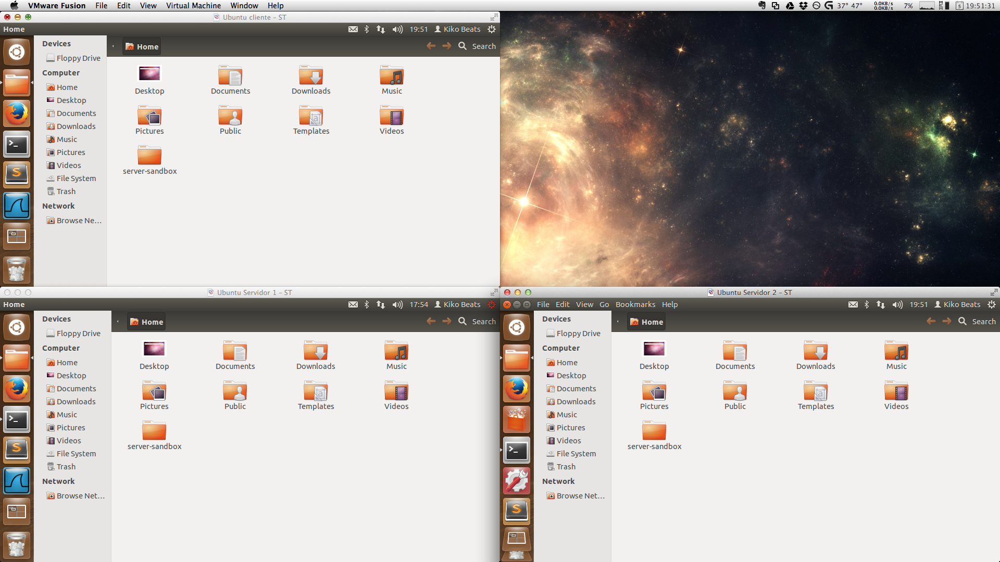
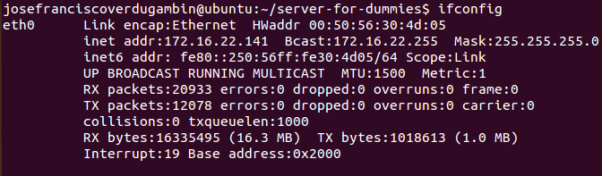

## Install the script

For each machine you will need to install the script. The steps to installing the scripts are very easy.

1) Open a new terminal and go to `PATH` for store the script. `cd $HOME` path is a good place.

2) Clone the repository from Github.

````bash
git clone https://github.com/Kikobeats/server-sandbox.git server-sandbox
````



Now is the moment to clone a virtual machine :-)

3) Go to the folder and edit `settings.sh` with your favorite editor. (e.g `gedit settings.sh` or 'vim settings.sh').

These are the following options:

```bash
## DNS Settings
DNS_NAME="st.um"
PRIMARY_DNS="172.16.22.135"
SECONDARY_DNS="172.16.22.137"
FORWARDERS=""

## SMTP Settings
LOCAL_NETWORK="172.16.22.0/24"
RELAY_DOMAINS="$DNS_NAME; um.es"

## OPENSSL Settings
USERNAME="josefranciscoverdugambin"
```

Set the values:

* **DNS_NAME**: Name you can use for you DNS. We use `st.um` but you can use many others like `server.dummie`, `server.dev` or whatever.


* **PRIMARY_DNS**: Your first server's IP. You know which one is yours using `ifconfig` command in your terminal (In my case `eth0` matches to the private network adapter).




* **SECONDARY_DNS**: Like `PRIMARY_DNS` but of your second server.


* **FORWARDERS**: DNS's IP used to resend the DNS query if we can't resolve it. You can use [Google open DNS](https://developers.google.com/speed/public-dns/?hl=es) for this (`8.8.8.8` and `8.8.4.4`).


* **LOCAL_NETWORK**: Network's IP used by VMWare/VirtualBox in the private network. You know this, check PRIMARY_DNS's IP and SECONDARY_DNS's IP and the netmask. If your netmask is `255.55.555.0` you have a **Class C Network** and the network's IP is `xxx.xxx.xxx.0/24`.


* **RELAY_DOMAINS**: Valid names for custom mail names.


* **USERNAME**: The username of your virtual machine account that is used to check the validity of the certificate.


4) Run the script with administrator privileges `sudo sh init.sh`


## Extra installation

About Mail service, the mail account is associated with a mail user account in the machine. For testing the mail, we recommended you create two accounts in the primary server. You can run:

````bash
sh ./Services/Mail/account
````

and the script create **user1** and **user2** for testing.
