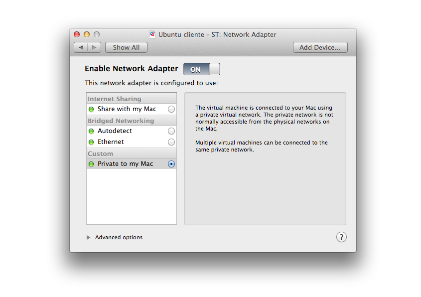

## Setting up a sandbox

We are going to use 3 virtual machines to learn how web services work.

The schema is formed by:

* **Virtual machine 1** – Main client
* **Virtual machine 2** – Primary DNS
* **Virtual machine 3** – Secondary DNS

We go to **[VMWare software](http://www.vmware.com/products/fusion/features)**. You can download a free version for 30 days.

Another option is using [VirtualBox](https://www.virtualbox.org). If you try this option, please feel free to send us a [feedback](https://github.com/Kikobeats/server-for-dummies/issues) :-)

About the machines, we are using the [latest stable LTS version of Ubuntu](https://wiki.ubuntu.com/LTS). In our case, **Ubuntu 12.04**. You can this in the [Ubuntu Official Website](http://www.ubuntu.com) and you can use Windows, Linux or Mac for this.

### Setting up network adapter in virtual machines

This step is important because we need to simulate that the machines are connected to each other.

First of all, select the virtual machine and go to `Settings` > `Removable Devices` section.

You must have a primary `Network Adapter`:


But you need to add another adapter too. Go to `Add Device` button, select `Network Adapter` and configure it like `private`.




It's necessary you do it in all the three machines. I recommend you to install and configure one virtual machine, and later clone it in other two. Before doing anything, you must read `Installing the script` section so you won't need to configure it three times.

## Installing VMWare Tools

VMware tools is useful to facilitate some things (e.g. copy and paste between virtual machines and your OS)

To install it, click in `Virtual Machine` > `Install VMWare tools` in your selected virtual machine.

When the disk is mounted, moved the content to a temporal folder:

```bash
cp -a /media/cdrom/VMwareTools* /tmp/
```

And later:

```bash
cd /tmp/
tar -vxzf VMwareTools*.gz
cd vmware-tools-distrib/
sudo ./vmware-install.pl
```

Doing [Enter] at all options (default selection) is enough.
