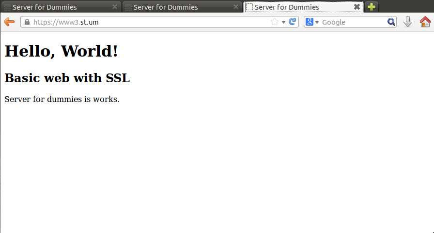
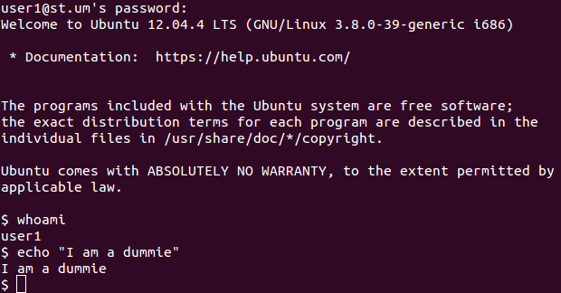

## Sample data

For testing services we added sample data for the follow services:

### HTTP

Dividided in:
* www1.st.um – Basic domain
* www2.st.um – Domain with HTTP authentication ([authorized users here](https://github.com/Kikobeats/server-for-dummies/blob/master/Services/HTTP/groups))
* www3.st.um – Domain with HTTPS (check you are visiting https in the browser! automatic redirect isn't activated).

### Mail

*(remember run `./Services/Mail/account.sh` to create it at first time in the primary server).*

### LDAP

*Sample data for check read and modify operations ([check here](https://github.com/Kikobeats/server-for-dummies/tree/master/Services/LDAP))*

### SSH

