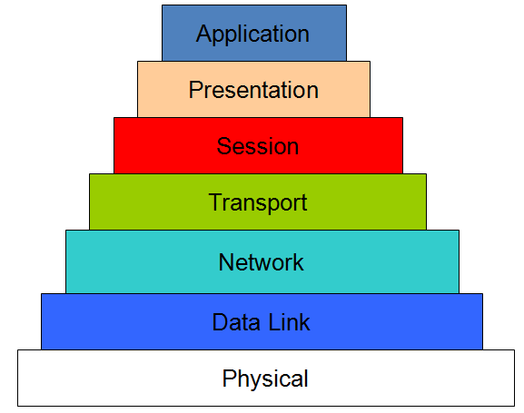
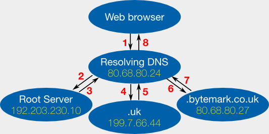

# Understand

Internet is the best invent in the last 50 years, and maybe someone can say that is the best invention in the world.

First, relax. Internet is not perfect and needs much human value to make it a secure service for daily things, for example, reading your mail, visiting a cats' website, downloading creative commons music and films...

Internet is nested in layers called [OSI model](https://en.wikipedia.org/wiki/OSI_model). Seven layers compound the OSI model and each layer offers services for differents things.

Top-level layers need their lower layer to offer a service. Your browser doesn't load a website if its transfer protocol doesn't work correctly.

Other important networks elements are routers, switches and host and using different protocols (BGP, RIP, OSPF) to communicate with each one and make internet a network of computers that understands how a package travles from EEUU to Spain.

But this is not important here. You'll need to understand how to set up your machine to be accesible for the others and to offer your services for resolving names, having mails accounts under your domain...

The services that you intend to use belong to the application layer. As I said before, this services use services or protocols of lower layers of the OSI model. For example, DNS is an aplication service, but it needs a transport protocol to resolve name to IP. By the other hand, IP is based on network layer IPv4 (or better, IPv6) to be operative for the application layer.

At the end, all is a stack of abstraction. The purpose is having an application layer available, secure and operative.

Now, is time to take action!