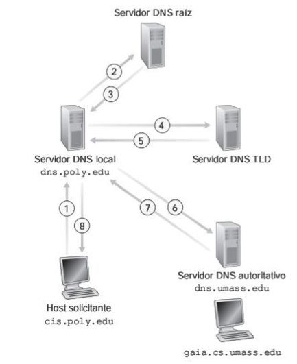
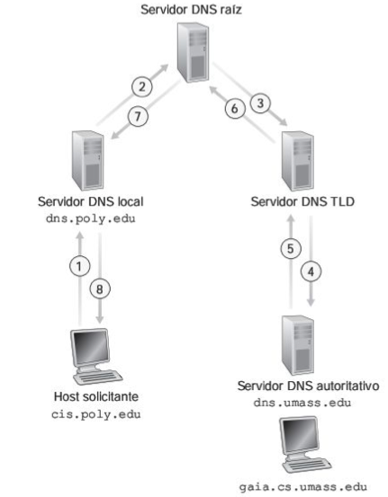

# DNS

DNS is one of the most important services for the Internet because it's necessary to convert a web name in a IP because of a very simple reason: Remembering an IP is more difficult than remembering a name.

First computers had a file called `host.txt` that worked similar to key/value dictionary: Each name has an IP translation. And one of this old computers was used to update the HOSTS.txt for the rest of the old computers. This is the concept.

It could seem easy if you'd have less than 10 computers all the world. But now, this is pretty complicated with all the computers we have.

The DNS service is regulated by the [ICANN since 1988](https://en.wikipedia.org/wiki/ICANN).

In order to understand how ICANN regulates it you must know that what it does is to designate root nodes to keep all information about how to resolve any domain. When you go to a website to register a website name, actually you are recording your domain in the ICANN nodes.

Each domain has different **records**. A record is the basic data component in DNS. Resource records not only define names and IP addresses, they define domains, servers, zone, and services as well. The following list shows you the most common types of resource records:

<table>
<tbody><tr>
<th>Type</th>
<th>Purpose</th>
</tr>
<tr>
<td><b>A</b></td>
<td><i>Address</i> resource records match an IP address to a host
name.</td>
</tr>
<tr>
<td><b>CNAME</b></td>
<td><i>Canonical name</i> resource records associate a nickname to
a host name.</td>
</tr>
<tr>
<td><b>MX</b></td>
<td><i>Mail exchange</i> resource records identify mail servers for
the specified domain.</td>
</tr>
<tr>
<td><b>NS</b> <b></b></td>
<td><i>Name server</i> resource records identify servers (other
than the SOA server) that contain zone information files.</td>
</tr>
<tr>
<td><b>PTR</b> </td>
<td><i>Pointer resource</i> records match a host name to a given IP
address. This is the opposite of an Address record, which matches
an IP address to the supplied host name.</td>
</tr>
<tr>
<td><b>SOA</b></td>
<td><i>Start of authority</i> resource records specify which server
contains the zone file for a domain.</td>
</tr>
<tr>
<td><b>SRV</b> </td>
<td><i>Service</i> resource records identify servers that provide
special services to the domain.</td>
</tr>
</tbody></table>

## DNS Query

The best way to explain the process is with an example.

You want to resolve `www.google.com`'s IP.

### Iterative Query

* Client query here local DNS. (1)
* If the local DNS doesn't know the domain, it answers the root nameserver. (2)
* Root Nameserves indicate the node that has `.com` > `google` register.
* Local DNS talk with the node and obtains the DNS authority nameserver. (4)(5)
* Local DNS contact with DNS authority nameserver for resolving `www`
* DNS authority nameserver responds local DNS.

This the normal process to resolve a query.

### Recursive Query

The process with recusive query is similar, but now the local DNS doesn't handle all the calls: DNS servers delegate in other DNS server to resolve the query.

## DNS Response

The server which is responded by the query is indicated in the **AA** (*Authoritative Answer*). It's possible that for each zone you have more than one DNS name server. This is known as **Primary** and **Secondary** DNS of the zone, and data redundancy is a measure of safety and reliability.

DNS response message:

