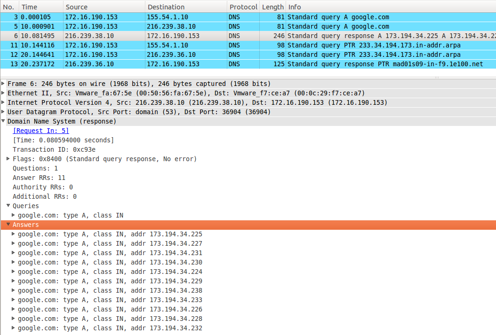

# How DNS works

## Internal query

For the example, I runt `dig st.um` command and see in the wireshark what happens:

The client do standard query connection at default DNS server (my server). In the header I say that I want to transalte `st.um` adress (of type `A`)

The server respond me. In the `answer` entry of the header you can see the IP of my request name, and the adress of the DNS server that serve the information:

## External query

This process is similar to internal query, but now depend of external DNS.

In this case, I do a `ping google.com` and in this process I need first translate `google.com` name into a IP name:

The DNS server respond me with a list of availables IPs for `google.com` domain:

Now, I can continue with my ping!