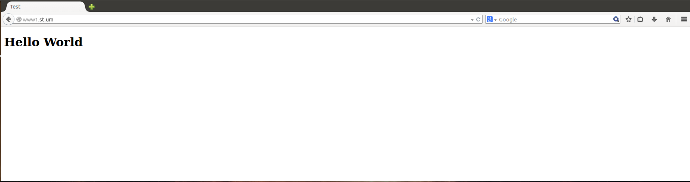
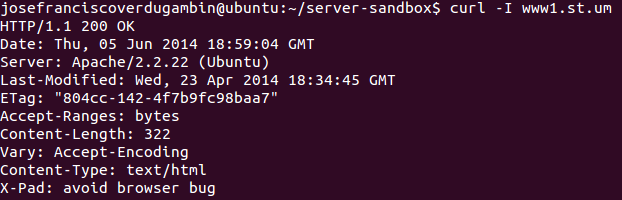

## Your HTTP in the client

If you have a browser and/or terminal, you don't need additional things.

When you install your server configuration can check this

### With browser

#### HTTP Simple (http://www1.st.um)

#### HTTP Simple with authentication (http://www2.st.um)

#### HTTP with SSL (https://www3.st.um)

### With terminal

With the browser url access is sufficient, but you need feel like a *hacker*, you can do the same but in terminal

