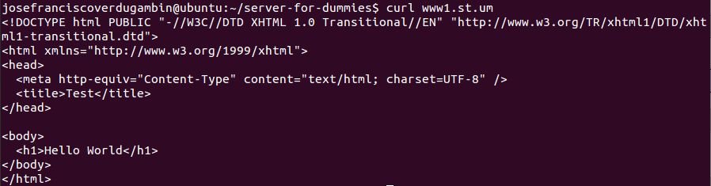

# Check connectivity

Run client browser and go to url examples:

1) Basic website:

2) Basic Apache authentication:

2) Secure HTTP connection:

Alternative you can do it with terminal and you get the source code of the website:

