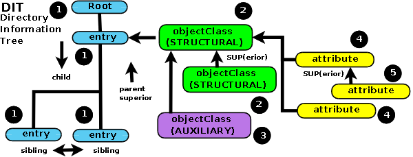

# LDAP

Maybe at this moment you don't know what is a LDAP but maybe you're using LDAP in the real life.

LDAP *(Lightweight Directory Protocol)* concept is similar to use an address book to annotate information about people around you: Adress, email, work, mobile number...

As the Internet, LDAP is your address book. And you can use LDAP for this. Your address book online!

LDAP is like a database, but it's specially designed for queries and for giving public information about employees of an organization or similar. The tree structure of a LDAP is known as **Directory Information Tree** (*DIT*):

LDAP objects are referenced by its **Distinguished Name** (*DN*). A DN is a sequence of **Relative Distinguished Names** (*RDN*) connected by commas.

An RDN is an attribute with an associated value in the form attribute=value; usually expressed in a UTF-8 string format.

Each entry is a **ObjectClass** that can contain a define type of attributes.

## LDAP Structure

LDAP is structured in entries. The first entry of a LDAP is simulated.

Typically LDAP have a tree distribution, but not always because there can be entries which be *alias* of another entry.

The entry of a LDAP is limited:

* **STRUCTURAL**: Is the ObjectClass that define the entry
* **AUXILIARY**: When the Objectclass is a parent of another ObjectClass. The *root ObjectClass* is `top`
* **ABSTRACT**: Optional ObjectClass that the entry can be container.

**Commonly Used ObjectClass**

| Type                 | Top                  | Atribute required  | Atribute Optional             |
|----------------------|----------------------|--------------------|-------------------------------|
| top                  |                      | objectClass        |                               |
| alias                | top                  | aliasedObjectClass |                               |
| person               | top                  |                    | description, seeAlso,         |
|                      |                      |                    | telephoneNumber,              |
|                      |                      |                    | userPassword                  |
| organizationalPerson | person               |                    | l, ou, postalAdress,          |
|                      |                      |                    | postalCode, st, street, title |
| inetOrgPerson        | organizationalPerson |                    | jpegPhoto, mail,              |
|                      |                      |                    | uid, o, userCertificate,...   |

**Commonly Used Attributes**

<table>
<tbody><tr><th>String</th><th>Attribute type</th></tr>
<tr><td><strong>DC</strong></td><td>domainComponent</td></tr>
<tr><td><strong>CN</strong></td><td>commonName</td></tr>
<tr><td><strong>OU</strong></td><td>organizationalUnitName</td></tr>
<tr><td><strong>O</strong></td><td>organizationName</td></tr>
<tr><td><strong>STREET</strong></td><td>streetAddress</td></tr>
<tr><td><strong>L</strong></td><td>localityName</td></tr>
<tr><td><strong>ST</strong></td><td>stateOrProvinceName</td></tr>
<tr><td><strong>C</strong></td><td>countryName</td></tr>
<tr><td><strong>UID</strong></td><td>userid</td></tr>
</tbody></table>
