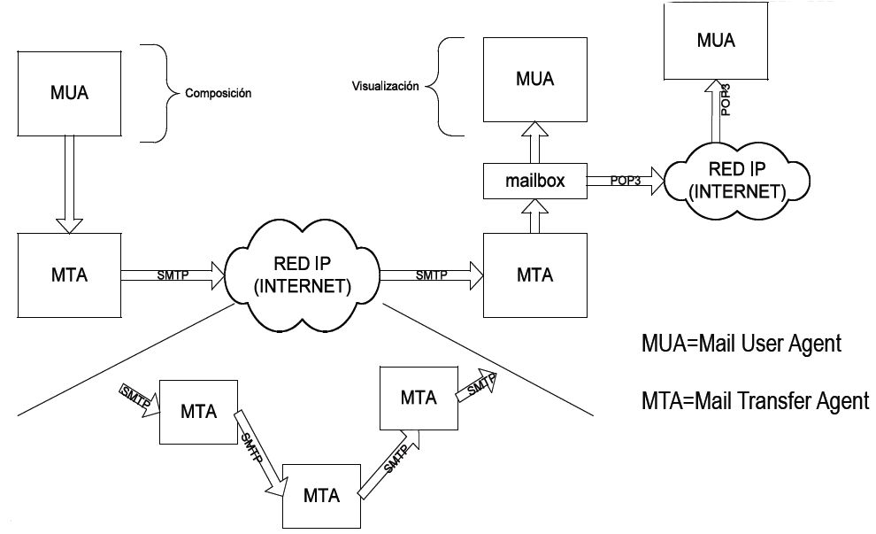

# Mail

Mail is the basic, oldest and most popular service of the internet.

When you want to send a mail, you going to deposit the mail in the receive mailbox of the receiver, but have a little problem: don't know the adress of the destination mailbox.

For know it, you need to use DNS query of the server name of the mailbox adress, and he say you the direction where you cand send the mail. And also the process is similar when you want to check your mail account. You can see this more later when We analyze the traffic with wireshark.

For support mail, you need support DNS before. This is because mail is based on mailbox concept: All mail accounts need a mailbox for send (**SMTP**) and receive (**POP3** or **IMAP**).

**SMTP**

Define the protocol necessary that transmit the message to the mailbox.

The options about how the message have to be interpreted is described in the **MIME** header.

`Content-Transfer-Encoding` s to avoid problems relaying the message for differents MTA. Can be:

* base64
* quoted-printable
* 7bit
* 8bit
* binary

The `Content-Type` can be:

* text
* image
* audio
* video
* applitacion
* message
* multipart

Is necesary define `Content-Type` for multipart messages that contains different type (for example text and attachment)

**POP3**

**IMAP**

IMAP keep more stuff in the server, for example, structure of folders and messages that you want to recovery for read it.

The protocol established different states for the connection. Internally, when the connection is established, the server interprets the command that is contained in the messages and do the actions:

