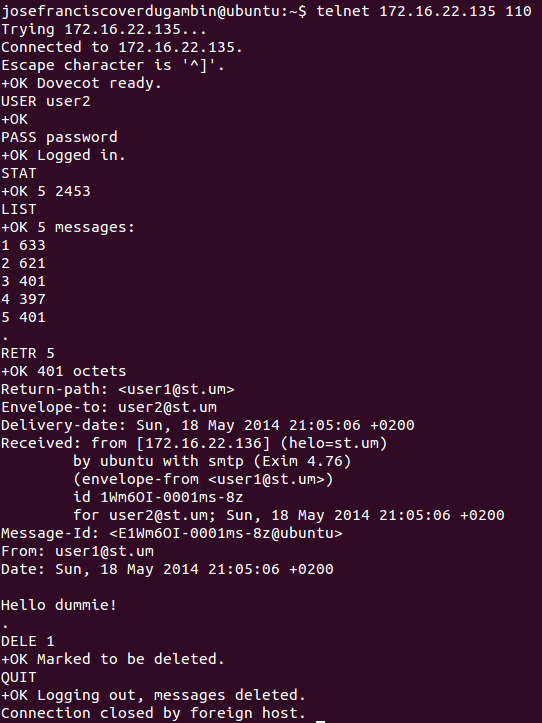

## Your Mail in the client

### With Mail client

Open mail client like **Thunderbird** (Installed by default in Ubuntu) and add two new accounts for `user1@st.um` and `user2@st.um` and try to send and receive messages.

### With terminal

Yea, I know. You need feel like a *hacker* again.

#### SMTP

#### POP3

