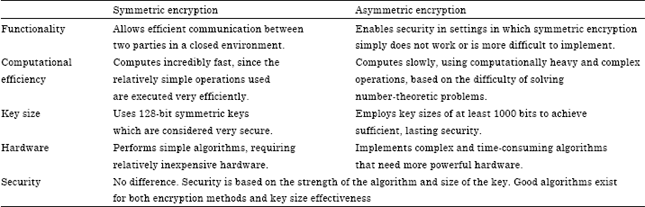

# SSL

SSL (*Secure Sockets Layer*) is the standard security technology for establishing an encrypted link between a web server and a browser. This link ensures that all data passed between the web server and browsers remain private and integral. SSL is an industry standard and is used by millions of websites in the protection of their online transactions with their customers.

SSL does two things:

1. **Authenticates the server to the client.** (*Handshake*)
2. Encrypts your HTTP session.

and in the Handshake:

* Client send **clientHello** first message specifying encrypted options about SSL version, compress method,... and sending random numbers that they use later.
* The server receives the message and selects:
  * What symmetric algorithm (**secret key**) use (e.g. [AES](https://en.wikipedia.org/wiki/Advanced_Encryption_Standard), [3DES](https://en.wikipedia.org/wiki/Triple_DES), [RC5](https://en.wikipedia.org/wiki/RC5)).
  * What asymmetric algorithm (**public key**) use (e.g. [RSA](wiki/RSA_(cryptosystem), [Diffie-Hellman](https://en.wikipedia.org/wiki/Diffie%E2%80%93Hellman_key_exchange)).
  * What MAC algorithm use ([SHA](https://en.wikipedia.org/wiki/Secure_Hash_Algorithm)).

**NOTE:** Is important know that MAC is [*Message authentication code*](https://en.wikipedia.org/wiki/Message_authentication_code). Don't confuse wit [MAC (*Media Access Control*) in Network layout](https://en.wikipedia.org/wiki/MAC_address).

But, why select symmetric and asymmetric algorithms? Why not use only one?

When client finally send data to the server, they use **symmetric algorithm**. This algorithm is based in **secret key** concept: The information is encrypted with a key that both parts know and travels encoded and later both parts decoded.

But obtain a secret key is complicated if everyone can spy your connection. would be useless.

Is necessary define a mechanism to can be possible that only both parts know the secret key!

This concept is known as **asymmetric algorithm**.

Asymmetric algorithm is divided in two key: **public key** and **secret key**. The public key is shared in the medium, and isn't dangerous, because only is possible decoded with the **secret key**.

Maybe your question at this time is... How to combine all?

This is known as **digital envelope**: Both parts use asymmetric algorithm to exchange a symmetric algorithm. And the step where both parts exchange information about asymmetric algorythm is known as **pre master key** (Because is *BEFORE* both parts obtain the master key, you know).

Typical combinations about it are:

* **TLSv1_RSA_WITH_AES_128_CBC_SHA**
  - **TLSv1**: version of TLS (SSL protocol)
  - **RSA**: For server authentication and pre master key process.
  - **AES**: For symmetric algorithm after master key
  - **SHA**: For MAC encryptation

* **TLSv1_DHE_RSA_WITH_AES_256_CBC_SHA**
  - **TLSv1**: version of TLS (SSL protocol)
  - **DHE**: For server authentication based of Diffie-Helman for pre master key.
  - **RSA**: For server authentication.
  - **AES**: For symmetric algorithm after master key.
  - **SHA**: For MAC encryptation.

You can see a comparison of both algorithms:

Client and server support different combinations of symmetric and asymmetric algorithms, but the purpose is the same: turn the insecure network in secure exchange the necessary information and do it transparent for third external element.

The concept that you need to keep in your mind that symmetrict algorithm only have a secret key, and asymmetrict algorithm have secret and public key.

Normally the public key is extracted of the he client/server certificate that is necessary in the SSL connection. (client certificate is optional because client certification isn't always necessary)

The process of getting a symmetric encryption via an asymmetric encryption is called a **digital envelope**.
