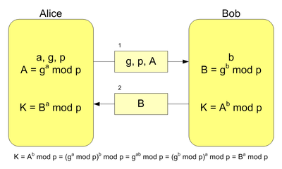

## How SSL Works

In the example, to get a symmetric algorithm we are going to use a Diffie Hellman asymmetric algorithm.

### Understanding Diffie-Hellman

The Diffie Hellman steps are:

1. Both parts agree `p` (prime number) value and `g` (primitive mod n) value.
2. Client choose random `a` value and send `A = g^a mod p` to the server.
3. Server choose random `b` value and send `B = g^b mod p` to the client.
4. Client calculate the shared secret => `s = B^a mod p`.
5. Server calculate the shared secret with => `s = A^b mod p`.
6. At this moment the information is encrypted with the shared secret.

Note that `s = g^(a*b) mod p = g^(b*a) mod p`.

## Resume of messages

Resume of messages:

We are going to analyze[1] the most importante messages about the protocol.

1) Client sends **Client Hello** message with a distinctive random number and information about what compression and Cipher suites support and request to the server the X509 certificate to trust him.

2) The server receives the messsage and determines what cipher suites and compression algorithms use in the session. Also sends to the client the **Server Certificate** for the client check that is valid and **Server Hello** message with a distinctive random number.

* **Server Hello**: With the client information the server determine what cipher suite and compression algorithm can be used in the session.
* **Server Certificate**: The server certificate contains the server’s public key. The client will use this key to authenticate the server and to encrypt the premaster secret.
* **Server Key Exchange**: Server send to the client the information relative to the asymmetric public key algorithm
* **Server Hello Done**: The server is finished and awaiting a response from the client.

Optionally in this step the server can request the authentication of the client.

3) Client receives the messages and prepare to turn in encrypted environment:

* **Client Key Exchange**: The client sends a Client Key Exchange message after computing the premaster secret using both random values. The premaster secret is encrypted by the public key from the server’s certificate before being transmitted to the server. Both parties will compute the master secret locally and derive the session key from it.
* **Change Cipher Spec**: This message notifies the server that all messages that follow the Client Finished message will be encrypted using the keys and algorithms just negotiated.

And the server validate the client message and turn in encrypted environment too:

4) At this point the data information travel encrypted.

