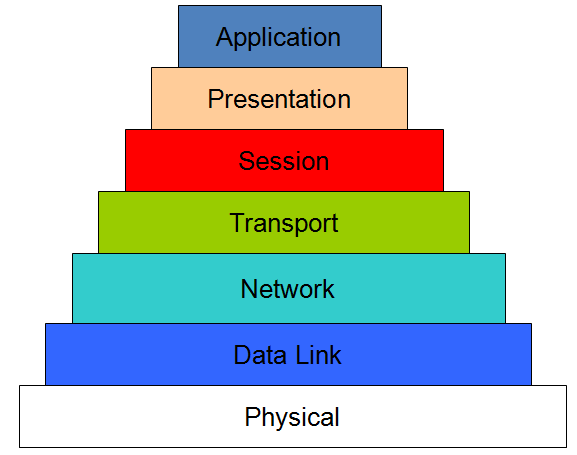
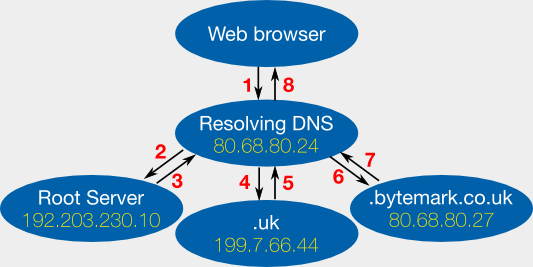

# 2. Understand

# 2.1. How Internet works

Internet is the best invent in the last 50 years, and maybe someone can say that is the best invention in the world.

First, relax. Internet is not perfect and needs much human value to make it a secure service for daily things, for example, reading your mail, visiting a cats' website, downloading creative commons music and films...

Internet is nested in layers called [OSI model](https://en.wikipedia.org/wiki/OSI_model). Seven layers compound the OSI model and each layer offers services for differents things.

Top-level layers need their lower layer to offer a service. Your browser doesn't load a website if its transfer protocol doesn't work correctly.

Other important networks elements are routers, switches and host and using different protocols (BGP, RIP, OSPF) to communicate with each one and make internet a network of computers that understands how a package travles from EEUU to Spain.

But this is not important here. You'll need to understand how to set up your machine to be accesible for the others and to offer your services for resolving names, having mails accounts under your domain...

The services that you intend to use belong to the application layer. As I said before, this services use services or protocols of lower layers of the OSI model. For example, DNS is an aplication service, but it needs a transport protocol to resolve name to IP. By the other hand, IP is based on network layer IPv4 (or better, IPv6) to be operative for the application layer.

At the end, all is a stack of abstraction. The purpose is having an application layer available, secure and operative.

Now, is time to take action!

## 2.2. Files

**DNS**

* `/etc/resolv.conf`
* `/etc/bind/named.conf.options`
* `/etc/bind/named.conf.local`
* `/etc/bind/db."$DNS_NAME".zone`

**SMTP**

* `/etc/exim4/update-exim4.conf.conf` # Exim4 settings

**POP**

* `/etc/dovecot/conf.d/10-mail.conf` # Dovecot settings
* `/etc/dovecot/conf.d/10-auth.conf` # Dovecot settings

**LDAP**

* `ldapmodify -Y EXTERNAL -H ldapi:/// -f FILE` # Modify LDAP settings
* `ldapadd -Y EXTERNAL -H ldapi:/// -f FILE` # Load database data

**HTTP**

* `/etc/apache2/sites-available` # Apache virtual hosts
* `/var/www/` # Apache websites data
* `/etc/apache2/groups` # Apache authentication

**SSL**

* `usr/lib/ssl/openssl.cnf` # Configuration file of SSL

**SSH**

* `~/.ssh` # Content SSH keys

## 2.3. Commands

**General**

`netstat -a | more` # show ports and services that you are using.

**DNS**

* `dig www.domain.com` # do DNS query
* `host www.domain.com` # know the IP of a name
* `nslookup www.domain.com` # check if DNS is resolve correctly

**SMTP**

* `telnet xxx.xxx.xxx.xxx 25` # basic query to SMTP service

**POP**

* `telnet xxx.xxx.xxx.xxx 110` # basic query to POP service

**LDAP**

* `ldapsearch -x -H ldap://LDAP_IP -b "cn='',ou='',o='',c=''" FIELD` # Search in the LDAP IP

**HTTP**

*  `curl www.domain.com` # get HTTP source code of a domain

**SSL**

* `openssl version -d` # report your SSL directory
* `openssl req -x509 -newkey rsa:2048 -keyout cakey.pem -days 3650 -out cacert.pem` # generate CA autosign in the server
* `openssl x509 -in cacert.perm -text` # Check that your server certificate is standard by x509
* `openssl rsa -in cakey.perm -text` # Cehck taht your server certificate is RSA correct
* `openssl req -new -nodes -newkey rsa:1024 -keyout serverkey.pem -out servercsr.pem` # Generate certificate client
* `openssl ca –keyfile cakey.pem -in servercsr.pem -out servercert.pem` # Sign certificate client by the server
* `openssl s_server -cert servercert.pem -key serverkey.pem -www` # Check that your client certificate is valid
