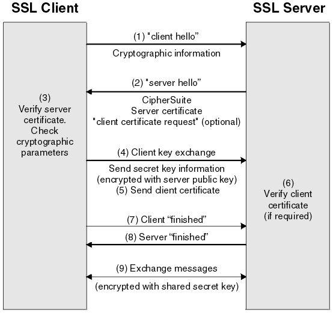
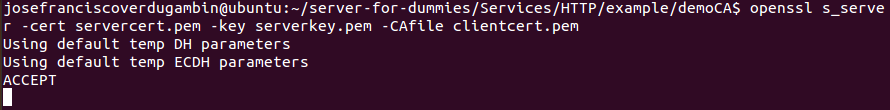
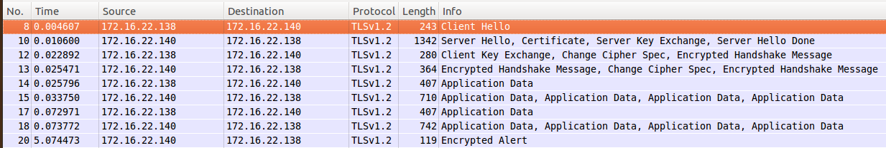
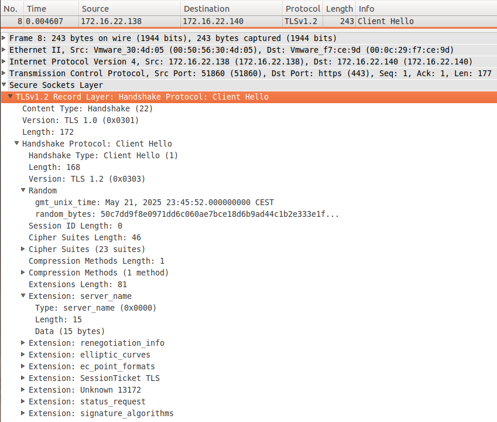
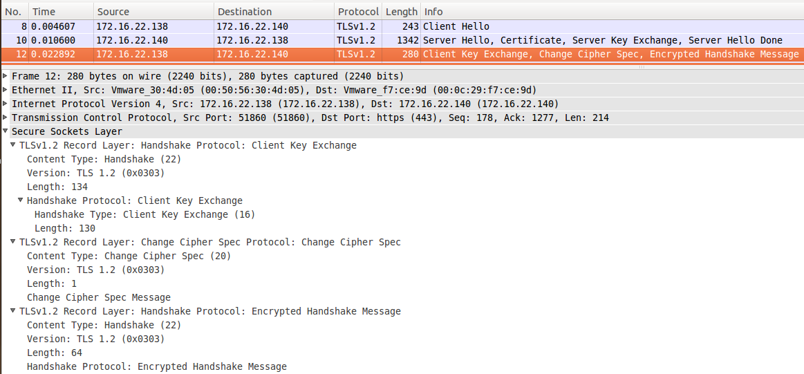
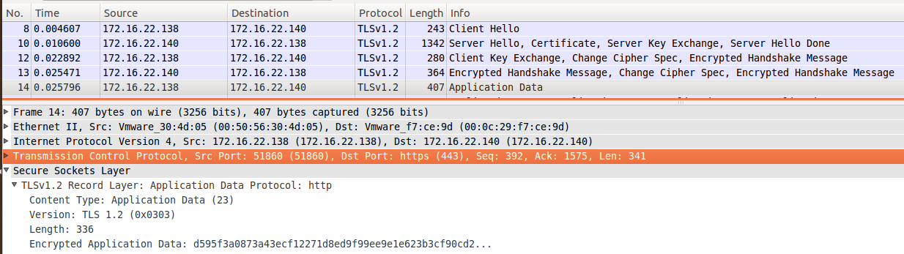
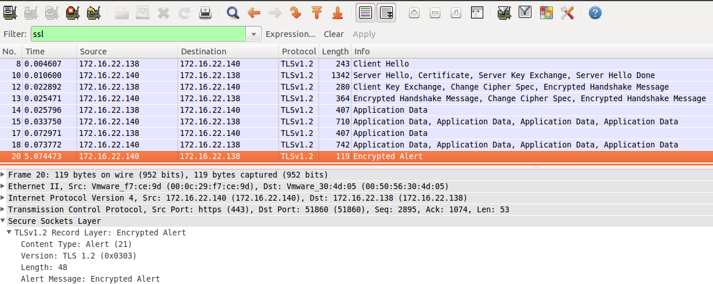

# 5. SSL

SSL (*Secure Sockets Layer*) is the standard security technology for establishing an encrypted link between a web server and a browser. This link ensures that all data passed between the web server and browsers remain private and integral. SSL is an industry standard and is used by millions of websites in the protection of their online transactions with their customers.

SSL does two things:

1. **Authenticates the server to the client.** (*Handshake*)
2. Encrypts your HTTP session.

We go to explain **Handshake** process:

* Client send `clientHello` message specifying encrypted options: SSL version, compress method,... and sending random numbers that they use later.
* The server receive the message and select:
	* What simetric algorythm (**secret key**) use (e.g. [AES](https://en.wikipedia.org/wiki/Advanced_Encryption_Standard), [3DES](https://en.wikipedia.org/wiki/Triple_DES), [RC5](https://en.wikipedia.org/wiki/RC5)).
	* What asimetric algorythm (**public key**) use (e.g. [RSA](wiki/RSA_(cryptosystem), [Diffie-Hellman](https://en.wikipedia.org/wiki/Diffie%E2%80%93Hellman_key_exchange)).
	* What MAC algorythm use ([SHA](https://en.wikipedia.org/wiki/Secure_Hash_Algorithm)).


Why select simetric and asimetric algorythm? Why not use only one?

When client finally send data to the server, they use simetric algorythm, but first, to get it, they need to negotiate and exchange confidence information. This proceed is known as **Pre Master Key**.

There are two ways to do Pre Master Key process:

1. With **Diffie-Helman**: Client and server exchange `SERVER_KEY_EXCHANGE` and `CLIENT_KEY_EXCHANGE` and both parts know 	the information to operate with simetric algorythm.

2. With **RSA**: The client catch the public key of the Server Certificate (message `CERTIFICATE`)and encrypted the master key. Only the server can desncrypted this with her private key.

And send to the client `serverHello` with this options, distinctive server number and their certificates to check the identify of the server domain.


But, one moment... Why am I going to trust the server? and if not who he claims to be?

Before Pre Master Key process is necessary for the server to authenticate it, for do it is also necessay asimetric algorythm, normally with RSA. And then, thec MAC algorythm is use to verify that data of the session is authenticathed.

We can resume all the process with two variants of message:

* **TLSv1_RSA_WITH_AES_128_CBC_SHA**
	- **TLSv1**: version of TLS (SSL protocol)
	- **RSA**: For server authentication and pre master key process.
	- **AES**: For simetric algorythm after master key
	- **SHA**: For MAC encryptation

* **TLSv1_DHE_RSA_WITH_AES_256_CBC_SHA**
	- **TLSv1**: version of TLS (SSL protocol)
	- **DHE**: For server authentication based of Diffie-Helman for pre master key.
	- **RSA**: For server authentication.
	- **AES**: For simetric algorythm after master key.
	- **SHA**: For MAC encryptation.

The resume of the process in one image:




The complexities of the SSL protocol remain invisible to your customers. Instead their browsers provide them with a key indicator to let them know they are currently protected by an SSL encrypted session - the lock icon in the lower right-hand corner, clicking on the lock icon displays your SSL Certificate and the details about it. All SSL Certificates are issued to either companies or legally accountable individuals.

## 5.1. Mount your SSL
### 5.1.1. SSL in the client

If the server has done its homework anything is necessary in the client, only have a modern browser and the `*.pem` to load it (see part of SSL in the server).

### 5.1.2. SSL in the server

For have SSL in HTTP known as HTTPS first you need to have HTTP service.

For have HTTPS you need a certificate to expose that your domain is secure and you are your owner.

Now we are to explain how to generate your certificate for do a illustrative example, but in the practice the SSL certificate is created by **Certification Authority** (*CA*) that typically are companies of hosting. Remember this.

The CA establishes a chain of trust between he and domains of users:


About what your need in your server we use **openssl** that is typically installed in UNIX systems by default.

The process is divided in two steps: First need to generate the CA autosign for the server and later generate the clien certificate and sign it with serve CA.

Typically an SSL Certificate will contain your domain name, your company name, your address, your city, your state and your country. It will also contain the expiration date of the Certificate and details of the Certification Authority responsible for the issuance of the Certificate. When a browser connects to a secure site it will retrieve the site's SSL Certificate and check that it has not expired, it has been issued by a Certification Authority the browser trusts, and that it is being us.

**CA Certificate in the server**

first need to know OpenSSL directory. In terminal type:

```
openssl version -d
```

And report you the directory, typically `usr/lib/ssl`. Now we need to edit `openssl.cnf` and update this entries with your values. In my case this are my values:

```
....
[ CA_default ]
...
dir = ./demoCA
countryName_default = ES
stateOrProvinceName_default =
0. organizationalName_default = UMU
organizationalUnitName_default = ST
...
```

because my domain is a Spanish domain and the domian for the exmaple is `st@um`.

Now go to adjust options to generate a certificate. in the same file and go to `[ policy_match ]` section and update set `stateOrProvinceName` value to `optional`.

Go to the path of CA_default and create `demoCA` folder with this structure:

```
cd $HOME
mkdir -p demoCA && cd demoCA
mkdir -p newcerts
mkdir -p certs
touch index.txt
echo "00" > clrnumber
echo "01" > serial
```

Now you are ready to generate the certificate. To do it, run the appropriate command:

```
openssl req -x509 -newkey rsa:2048 -keyout cakey.pem -days 3650 -out
cacert.pem
```

You can check that your certificate is correct with this commands:
```
openssl x509 -in cacert.perm -text
openssl rsa -in cakey.perm -text
```

**CA Certificate in the client**

First generate it:

```
openssl req -new -nodes -newkey rsa:1024 -keyout serverkey.pem -out servercsr.pem
```

And later sign it:

```
openssl ca –keyfile cakey.pem -in servercsr.pem -out servercert.pem
```
The certificate on `*.pem` is necessary because is the format that the browser can read the certificate.

You can check that certificate is valid running this command:
```
openssl s_server -cert servercert.pem -key serverkey.pem -CAfile clientcert.pem
```



## 5.2. Check connectivity

## 5.3. How SSL Works

Resume of the process:


Resume of messages:



1) Client send `HELLO` message with distinctive random number and information about what compression and Cipher suites support and request to the server the X509 certificate to trust him.



2) The server receive the message and:

1. Read the `HELLO` message of the client and select the options of the session.
2. Send to the client the Certificate to show that you can trust him.
3. do `SERVER_KEY_EXCHANGE` as part of the process of Pre Master Key


3) Client receive server message and proceed to:

1. Validate the identity of the server.
2. do `CLIENT_KEY_ECHANGE` as part of the process of Pre Master Key.

at this moment client can be calculate the **Master Key**.



4) Server receive client message and can calculate **Master Key**. From here both part have a shared secret


5) The information from here can travel encrypted. Is not posible see the data content





