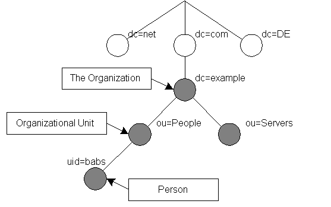
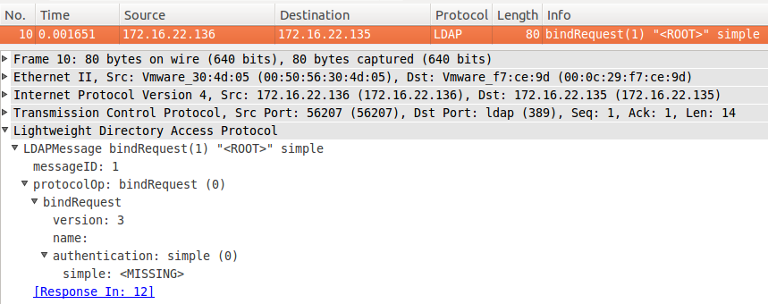
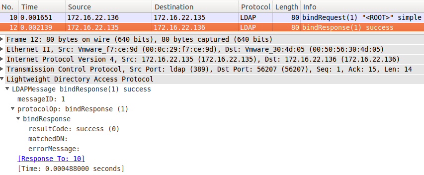
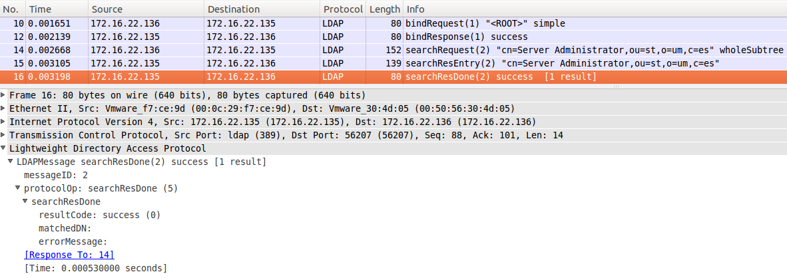

# 6. LDAP

Maybe at this moment you don't know what is a LDAP but maybe use LDAP in the real life.

LDAP *(Lightweight Directory Protocol)* concept is similar to use a address book to annotate information about people around you: Adress, email, work mobile,...

As Internet, LDAP is your adress book. And you can use LDAP for this. Your Adress book online!

LDAP is like database, but is specially designed for queries and put public information about employees of an organization or similar. The tree structure of a LDAP is known as **Directory Information Tree** (*DIT*):



LDAP object are referenced  by its **Distinguished Name** (*DN*). A DN is a sequence of **Relative Distinguished Names** (*RDN*) connected by commas.

An RDN is an attribute with an associated value in the form attribute=value; normally expressed in a UTF-8 string format.


**Commonly Used Attributes**

<table>
<tbody><tr><th>String</th><th>Attribute type</th></tr>
<tr><td><strong>DC</strong></td><td>domainComponent</td></tr>
<tr><td><strong>CN</strong></td><td>commonName</td></tr>
<tr><td><strong>OU</strong></td><td>organizationalUnitName</td></tr>
<tr><td><strong>O</strong></td><td>organizationName</td></tr>
<tr><td><strong>STREET</strong></td><td>streetAddress</td></tr>
<tr><td><strong>L</strong></td><td>localityName</td></tr>
<tr><td><strong>ST</strong></td><td>stateOrProvinceName</td></tr>
<tr><td><strong>C</strong></td><td>countryName</td></tr>
<tr><td><strong>UID</strong></td><td>userid</td></tr>
</tbody></table>

## 6.1 Information

| Description  | Service
| -------------	|:-------------
| Aplication	|	LDAP
| Transport		|	TCP/UDP
| Network		|   IPv4/IPv6
| Ports			|	389 (TCP/UDP)


## 6.2 Mount your LDAP
### 6.2.1 Your LDAP in the client

For search in the LDAP client need to install **ldap-utils** command. Later We can configure your typical mail client (Thunderbild, for example) to search in the LDAP when you need a compose a mail and need to know the destination account.

### 6.2.2 Your LDAP in the server

In the server need to install **slapd** service configue the database schema and insert sample data. In this case we have the defintions of the data and the information in the `Services/LDAP/*.dif` files and use `Services/LDAP/server.sh` for boostrapping process. This is set up when you choice install LDAP:

```
echo " * Installing LDAP..."
apt-get -y install slapd ldap-utils

echo " * Adding LDAP database..."
# Load database
sudo ldapmodify -Y EXTERNAL -H ldapi:/// -f "$DIR"/loadDBD.ldif;

echo " * Loading LDAP example schema..."
# Load database models schema
sudo ldapadd -Y EXTERNAL -H ldapi:/// -f /etc/ldap/schema/inetorgperson.ldif;
sudo ldapadd -Y EXTERNAL -H ldapi:/// -f /etc/ldap/schema/cosine.ldif;

echo " * Adding LDAP custom schema ..."
# Load own schema for the example
sudo ldapadd -Y EXTERNAL -H ldapi:/// -f "$DIR"/stSchema.ldif;

echo " * Configuring LDAP database..."
# Load database configuration
sudo ldapmodify -Y EXTERNAL -H ldapi:/// -f "$DIR"/confDatabase.ldif;

echo " * Inserting LDAP data..."
# Insert fake data for the example
sudo ldapmodify -D "cn=admin,o=um,c=es" -W -H ldap:/// -f "$DIR"/st.ldif;
```


## 6.3 Check connectivity


## 6.4 How LDAP works


Resume:


1) BindRequest (Authentication)



2) BindResponse



3) SearchRequest


4) SearchResponse


5) SearchDone



6) unbinRequest


