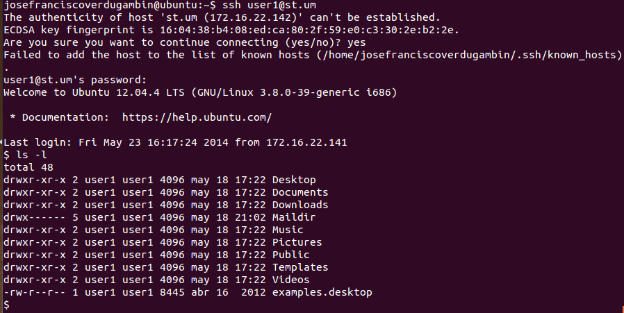
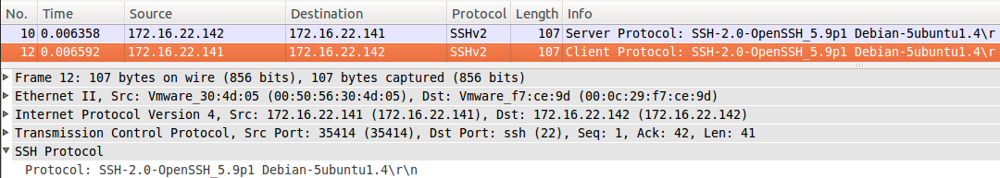

# 8. SSH

SSH (*Secure Shell*)  is a cryptographic network protocol for secure data communication, remote command-line login, remote command execution, and other secure network services between two networked computers.

It was designed as a replacement for Telnet and other insecure remote shell protocols such as the Berkeley rsh and rexec protocols, which send information, notably passwords, in plaintext, rendering them susceptible to interception and disclosure using packet analysis. The encryption used by SSH is intended to provide confidentiality and integrity of data over an unsecured network, such as the Internet.

## 8.1 Information

| Description  | Service
| -------------	|:-------------
| Aplication	|	SSH
| Transport		|	TCP
| Network		|   IPv4/IPv6
| Port			|	21

## 8.2 Mount your SSH

### 8.2.2 Your SSH in the client

The client needs **openssh-client** that is usually installed on UNIX systems default

Also need to generate a **SSH public key** to identify the computer. SSH keys are a way to identify trusted computers, without involving passwords.

**Check your SSH keys**

```
cd ~/.ssh
ls -al
# Lists the files in your .ssh directory
```

**Generate a new SSH key**

```
ssh-keygen -t rsa -C "your_email@example.com"
# Creates a new ssh key, using the provided email as a label
# Generating public/private rsa key pair.
# Enter file in which to save the key (/Users/you/.ssh/id_rsa): [Press enter]
Enter passphrase (empty for no passphrase): [Type a passphrase]
# Enter same passphrase again: [Type passphrase again]
Your identification has been saved in /Users/you/.ssh/id_rsa.
# Your public key has been saved in /Users/you/.ssh/id_rsa.pub.
# The key fingerprint is:
# 01:0f:f4:3b:ca:85:d6:17:a1:7d:f0:68:9d:f0:a2:db your_email@example.com
```

### 8.2.1 Your SSH in the server

Only need to install **openssh-server**.

## 8.3 Check connectivity



## 8.3 How SSH works

Resume of messages:


1) Client first message


2) Server first message



3) Client send `CLIENT_KEY_EXCHANGE`


4) Server send `CLIENT_KEY_EXCHANGE`


5) Exchange sucess!


6)


7)


