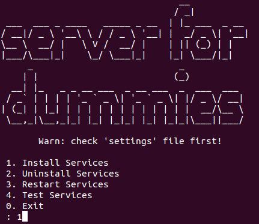
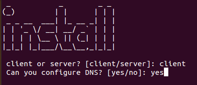
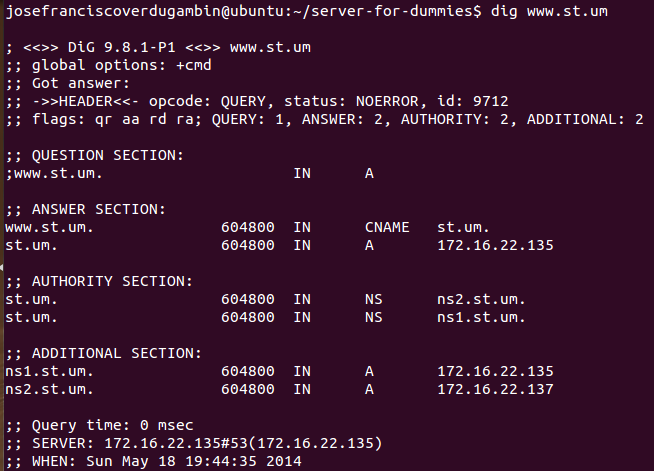
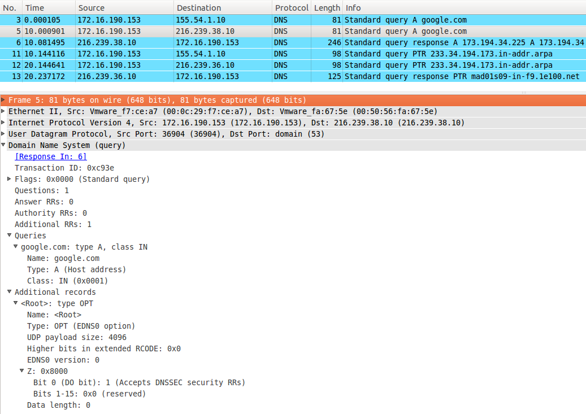

# 3. DNS

DNS is one of the most importante services for internet because is necessary to convert a name of one web in here IP for simply question: Remember a IP is very most difficult that remember a name.

In the begin, to do it, the firsts computer had a simply file called 'HOST.TXT' that works similar with a hash key/value: One name have one IP translation. And one of this olds computers is used to serve the HOSTS.txt updated of the rest of olds computers. This is the concept.


This is simply if you have less than 10 computers in the world. But now, this is a bit complicated with too much computers.

The DNS service is regulated by the [ICANN since 1988](https://en.wikipedia.org/wiki/ICANN)

Basically for understand how do ICANN regulated it, ICANN designate a root nodes to keep all information about how to resolve whatever domain. When you go to website to register a website name, actually you are registrying your domain in the ICANN.


## 3.1 Information

| Description  | Service
| -------------	|:-------------
| Ports			|	53/UDP, 53/TCP
| Aplication	|	DNS 			
| Transport		|	TCP/UDP			
| Network		|   IPv4/IPv6	
	
	
Check typical DNS records [here](https://en.wikipedia.org/wiki/List_of_DNS_record_types).

## 3.2 Mount your DNS

Have your DNS is simply. Only need have set up your service locally and this will connect with ICANN nodes to resolve web adress. And you can use your local DNS to make resolve Web names

## 3.2.1 Your DNS in the client

You need to say at your client that use your DNS to resolve names. Run te script and select this options:





Now, you have said in your client that use the IP of your server to resolve names. This is in the file `/etc/resolv.conf`:

```
echo " * Configuring DNS client..."
echo "# Dynamic resolv.conf(5) file for glibc resolver(3) generated by resolvconf(8)
# DO NOT EDIT THIS FILE BY HAND -- YOUR CHANGES WILL BE OVERWRITTEN
nameserver $PRIMARY_DNS
nameserver $SECONDARY_DNS
#search localdomain
" > /etc/resolv.conf
```

In my case have two servers for primary and secondary DNS.


## 3.2.2 Your DNS in the server

Server config is also simple, but it requires a few extra steps.

When you run the script for this:


the script do it in the primary server:

1. Install **bind9**, a application to provide DNS services
2. Edit `/etc/resolv.conf` file and add your own direction
3. Set up **bind9** to define your domain database and your secondary IP if is defined.

```
write_config_local_server(){
echo "zone \"$DNS_NAME.\" IN {
  type master;
  file \"/etc/bind/db.$DNS_NAME.zone\";
  allow-transfer {$SECONDARY_DNS;};
  }; " > /etc/bind/named.conf.local
}
```

3. In the domain database write entries to be resoluble main services that use DNS to access it:

```
write_database(){
echo "\$TTL  604800
@ IN  SOA ns1.$DNS_NAME. root.ns1.$DNS_NAME. (
            1   ; Serial
       604800   ; Refresh
        86400   ; Retry
      2419200   ; Expire
       604800 ) ; Negative Cache TTL

@             IN      NS         ns1.$DNS_NAME.
ns1           IN      A          $PRIMARY_DNS
@             IN      NS         ns2.$DNS_NAME.

ns2           IN      A          $SECONDARY_DNS
$DNS_NAME.    IN      A          $PRIMARY_DNS

smtp          IN      CNAME      $DNS_NAME.
pop3          IN      CNAME      $DNS_NAME.
ldap          IN      CNAME      $DNS_NAME.
www           IN      CNAME      $DNS_NAME.
www1          IN      CNAME      $DNS_NAME.
www2          IN      CNAME      $DNS_NAME.
www3          IN      CNAME      $DNS_NAME.
" > /etc/bind/db."$DNS_NAME".zone
}
```

For the secondary server, the setting is more easy because this use primary server to get information and don't need too configuration:

```
write_config_local_client(){
echo "zone \"$DNS_NAME.\" IN {
  type slave;
  file \"/var/cache/bind/db.$DNS_NAME.zone\";
  masters {$PRIMARY_DNS;};
};
" > /etc/bind/named.conf.local
}
```

## 3.3 Check connectivity

You can check connectivity in the client with two commands:




# 3.4 How DNS works


# 3.4.1 Internal query

For the example, I runt `dig st.um` command and see in the wireshark what happens:

The client do standard query connection at default DNS server (my server). In the header I say that I want to transalte `st.um` adress (of type `A`)


The server respond me. In the `Answer`entry of the header you can see the IP of my request name, and the adress of the DNS server that serve the information:


# 3.4.2 External query

This process is similar to internal query, but now depend of external DNS.

In this case, I do a `ping google.com` and in this process I need first translate `google.com` name into a IP name:



The DNS server respond me with a list of availables IPs for `google.com` domain:


Now, I can continue with my ping!