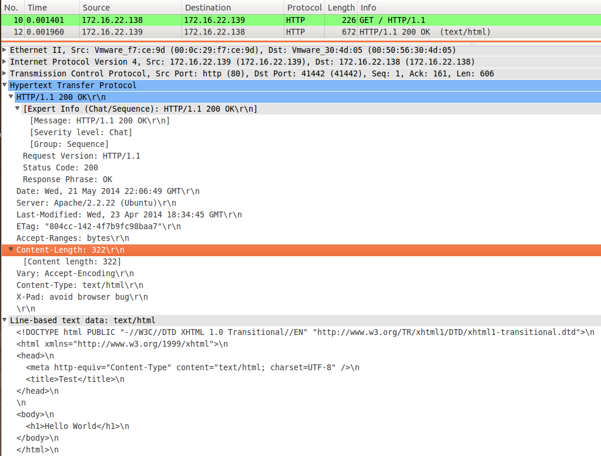

# 4. HTTP

HTTP (short for *HyperText Transfer Protocol*) is the underlying protocol used by the World Wide Web. HTTP defines how messages are formatted and transmitted, and what actions Web servers and browsers should take in response to various commands. For example, when you enter a URL in your browser, this actually sends an HTTP command to the Web server directing it to fetch and transmit the requested Web page.

You can use HTTP for differents actions:

And the actions reports a status code:

## 4.1 Information

| Description  | Service
| -------------	|:-------------
| Aplication	|	HTTP 			
| Transport		|	TCP		
| Network		|   IPv4/IPv6	
| Port   		|	80

## 4.2 Mount your HTTP

### 4.2.1 Your HTTP in the client

If you have a Browser and/or terminal, you don't need additional things.

### 4.2.1 Your HTTP in the server

We use **apache** and **php**.

apache is used to service files and can be resolve in the client. Also, we can configure it to mount differents domains separated but under the same machine.

For do it, first need define **virtual hosts**. In the example we use 3 virtual hosts:

* virtual host to www1.st.um and basic website.
* virtual host to www2.st.um and basic apache authentication.
* virtual host to www3.st.um to get a secure HTTP based on SSL certificate (HTTPS).

This files are defined in `Services/example/` and with the script we go to copy differents files to differents folders:

* We copy the files of the virtual hosts `Services/example/vhost` to `/etc/apache2/sites-available`
* We copy the files of the websites `Services/example/sites` to `/var/www/`
* We copy the files of the apache authentication methd  `Services/example/groups` to `/etc/apache2/groups`

## 4.3 Check connectivity

Run client browser and go to url examples:

1) Basic website:

2) Basic Apache authentication:

2) Secure HTTP connection:

Alternative you can do it with terminal and you get the source code of the website:

## 4.4 How HTTP works

1) HTTP Request (GET Command)

2) HTTP Response (200 OK code status)

