# 7. SMTP/POP

Mail is the basic, oldest and most popular service of the internet.

For support mail, you need support DNS before. This is because mail is based on mailbox concept: All mail accounts need a mailbox for send (SMTP) and receive (POP3/IMAP).


When you want to send a mail, you going to deposit the mail in the receive mailbox of the receiver, but have a little problem: don't know the adress of the destination mailbox.

For know it, you need to use DNS query of the server name of the mailbox adress, and he say you the direction where you cand send the mail. And also the process is similar when you want to check your mail account. You can see this more later when We analyze the traffic with wireshark.

## 7.1 Information


| Description  | Service
| -------------	|:-------------
| Aplication	|	SMTP 
| Transport		|	TCP	
| Network		|   IPv4/IPv6	
| Ports			|	25/TCP, 587/TCP (alternative), 465/TCP (SMTPS)


| Description  | Service
| -------------	|:-------------
| Aplication	|	POP3 			
| Transport		|	TCP
| Network		|   IPv4/IPv6	
| Ports			|	110/TCP, 995/TCP (encrypted)

| Description  | Service
| -------------	|:-------------
| Aplication	|	IMAP 			
| Transport		|	TCP			
| Network		|   IPv4/IPv6	
| Ports			|	143/TCP, 220/TCP (IMAP3), 993/TCP (IMAPS)


## 7.2 Mount your Mail

### 7.2.1 Your Mail in the server

we will set up two typical services for mail:

* **SMTP** is the protocol to can send emails.
* **POP3** is one of the posibles protrocols to receive mails that we are to use. The other common protocol is **IMAP**.


The differences between POP3 and IMAP are littles but importants:


<table border="1" cellspacing="1" cellpadding="7" width="568">
  <tbody><tr>
    <td width="50%" valign="top" bgcolor="#FFFFFF" background="bg.gif">
      <p align="center"><b>POP3</b></p></td>
    <td width="50%" valign="TOP" bgcolor="#ffffff" background="bg.gif">
      <p align="center"><b>IMAP</b></p></td>
  </tr>
  <tr>
    <td width="50%" valign="TOP">Since email needs to be downloaded into
      desktop PC before being displayed, you may have the following problems for
      POP3 access:
      <ul>
        <li>You need to download all email again when using another desktop PC
          to check your email.</li>
        <li>May get confused if you need to check email both in the office and
          at home.</li>
      </ul>
      <p>The downloaded email may be deleted from the server depending on the
      setting of your email client.</p></td>
    <td width="50%" valign="TOP">Since email is kept on server, it would gain
      the following benefits for IMAP access:
      <ul>
        <li>No need to download all email when using other desktop PC to check
          your email.</li>
        <li>Easier to identify the unread email.</li>
      </ul>
    </td>
  </tr>
  <tr>
    <td width="50%" valign="TOP">All messages as well as their attachments will
      be downloaded into desktop PC during the 'check new email' process.</td>
    <td width="50%" valign="TOP">A whole message will be downloaded only when it
      is opened for display from its content.</td>
  </tr>
  <tr>
    <td width="50%" valign="TOP">Mailboxes can only be created on desktop PC.
      There is only one mailbox (INBOX) exists on the server.</td>
    <td width="50%" valign="TOP">Multiple mailboxes can be created on the
      desktop PC as well as on the server.</td>
  </tr>
  <tr>
    <td width="50%" valign="TOP">Filters can transfer incoming/outgoing messages
      only to local mailboxes.</td>
    <td width="50%" valign="TOP">Filters can transfer incoming/outgoing messages
      to other mailboxes no matter where the mailboxes locate (on the server or
      the PC).</td>
  </tr>
  <tr>
    <td width="50%" valign="TOP">Outgoing email is stored only locally on the
      desktop PC.</td>
    <td width="50%" valign="TOP">Outgoing email can be filtered to a mailbox on
      server for accessibility from other machine.</td>
  </tr>
  <tr>
    <td width="50%" valign="TOP">Messages are deleted on the desktop PC.
      Comparatively, it is inconvenient to clean up your mailbox on the server.</td>
    <td width="50%" valign="TOP">Messages can be deleted directly on the server
      to make it more convenient to clean up your mailbox on the server.</td>
  </tr>
  <tr>
    <td width="50%" valign="TOP">Messages may be reloaded onto desktop PC
      several times due to the corruption of system files.</td>
    <td width="50%" valign="TOP">The occurrence of reloading messages from the
      server to PC is much less when compared to POP3.</td>
  </tr>
</tbody></table>


### 7.2.3 Configuring POP3


1. Install the service **dovecot** for use POP3 in your server.
2. Configure defaults options in `/etc/dovecot/conf.d/10-auth.conf` and `/etc/dovecot/conf.d/10-mail.conf`.

### 7.2.2 Configuring SMTP


1. Install the service **exim4**
2. Configure standards options in `/etc/exim4/update-exim4.conf.conf` about your DNS:

```
dc_eximconfig_configtype='internet'
dc_other_hostnames='$DNS_NAME'
dc_local_interfaces=''
dc_readhost=''
dc_relay_domains='$RELAY_DOMAINS'
dc_minimaldns='false'
dc_relay_nets='$LOCAL_NETWORK'
dc_smarthost=''
CFILEMODE='644'
dc_use_split_config='false'
dc_hide_mailname=''
dc_mailname_in_oh='true'
dc_localdelivery='maildir_home'
```

## 7.3 Check connectivity

For the test first we ping the DNS service and later do a telnet in the port of the service.

### 7.3.1 SMTP

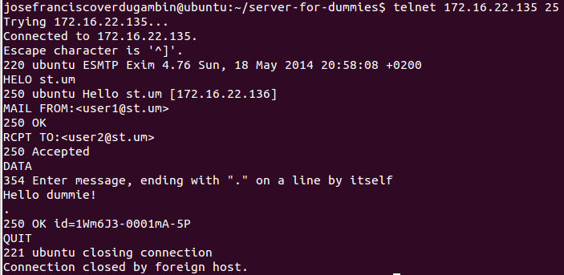

### 7.3.2 POP3


## 7.4 How Mail Works

### 7.4.1 SMTP


Resume


1) Server presentation
 


2) Client HELO and sending his IP

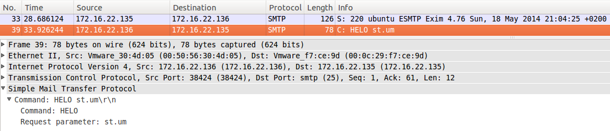

3) Server reply


4) Client FROM mail account

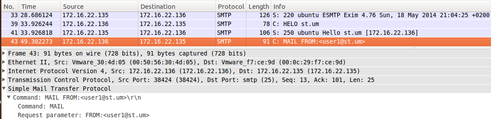

5) Server reply


6) Client send RCTP mail account

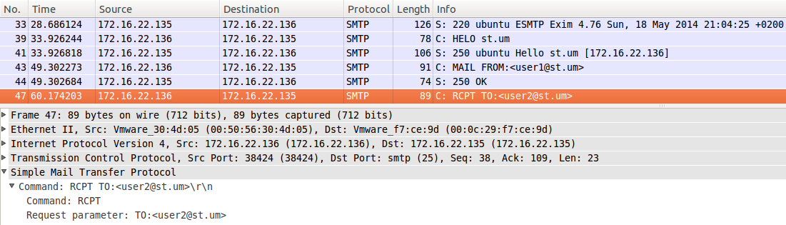

7) Server reply


8) Client prepare to send DATA

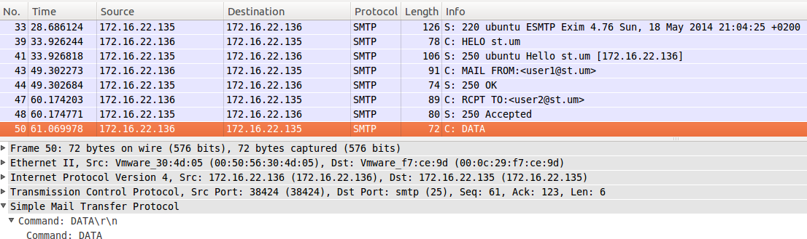

9) Server reply and say that write a "." to finish the message

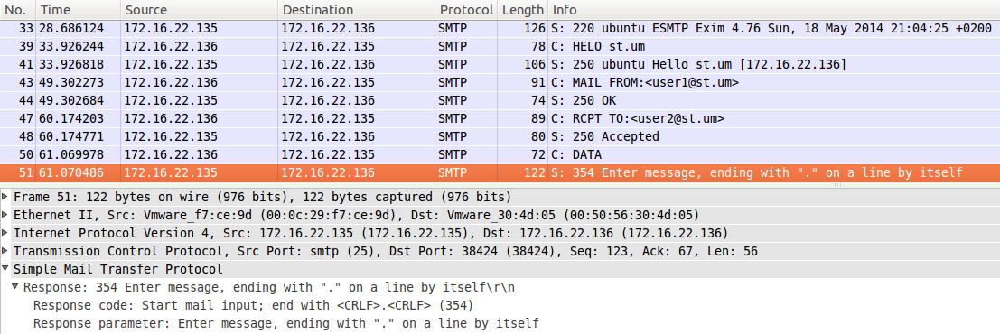

10) Client send the text of the message


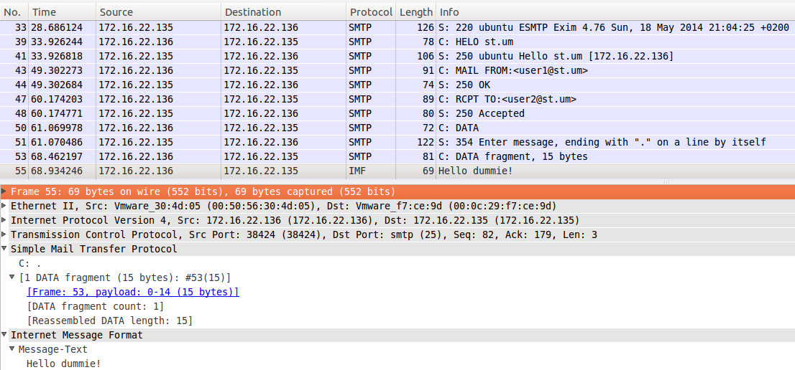

11) Server reply when the client finish to send the message


12) Client termiante the connection

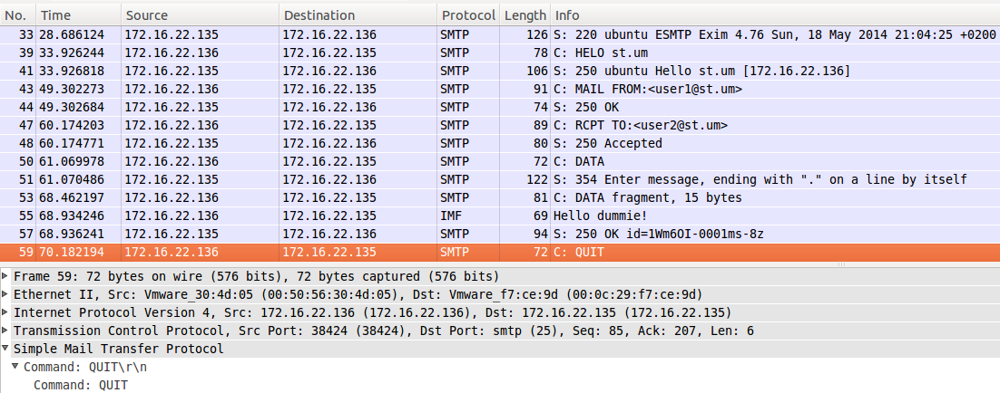

13) Server reply


### 7.4.1 POP3

The most commonly used commands in a POP3 connection are as follows:

> **USER <username>**
> **PASS <password>**
> Command to make login with a username and password. The server response if the login is correct or not.
> 
> **STAT**
> STAT simply responds with a single line consisting of two numbers: the number of messages in the box and the total size of those messages in bytes. It's useful for human beings, but less so for automatic clients, which are likely to jump straight to the LIST command.
> 
> **LIST**
> LIST lists the contents of the mailbox, naturally enough. It does so by using the standard POP3 multi-line response format. Here's an example:
>   LIST
>   +OK Mailbox contents follow
>   1 7774
>   2 513
>   3 10493
>   .
> The terminating line is a period on a line by itself, which is pretty standard for mail protocols in general. Each line consists of the mail message number (if you delete one, it won't appear in the list, so don't fall into the trap that the numbers are sequential and can thus be ignored!) followed by the size of the message in bytes.
> LIST plus a message number will simply act like STAT for that message.
> 
> **RETR msg**
> RETR retrieves a message. Use the message number from LIST. Note that you'll receive the true text of the message, headers followed by a blank line followed by the body, followed by a period on a line by itself. If the body actually contains a period on a line by itself, the mail server will already have doubled that period. So your client needs to undouble it.
> 
> **DELE msg**
> DELE deletes a message. It won't actually be deleted until you QUIT the session, and you can undelete everything you've deleted (in case of a mistake) by using RSET.
> 
> **RSET**
> You can reset the session to its initial state using the RSET command. This will undelete all messages deleted using DELE.
> 
> **TOP msg n**
> TOP is actually an optional command, but most servers support it now. It returns the headers of message msg plus n lines of the body. If n is zero, of course, you just get the headers, which is nice for doing filtering without having to get the entire message.
> 
> **QUIT**
> QUIT terminates the session and deletes any messages marked with DELE.


Resume

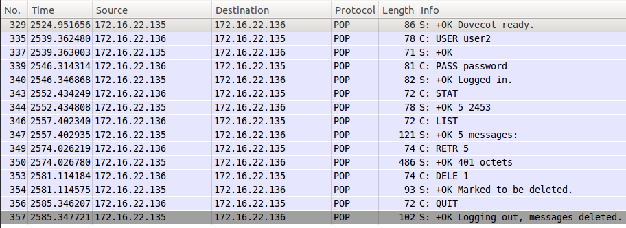

1) Server presentation2. 

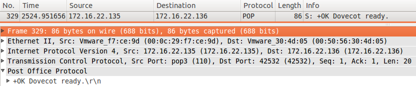

2) Client identify with USER command


3) Server reply


4) Client type password with PASS command

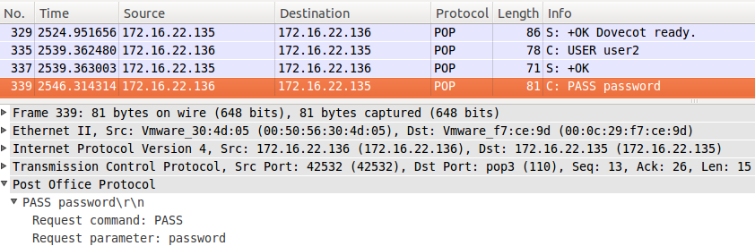

5) Server reply and say that loggin is correct

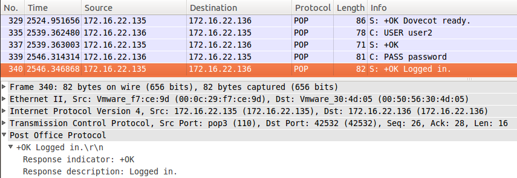

6) Client use STAT command

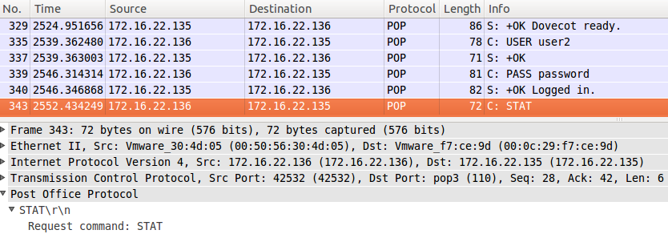

7) Server Reply


8) Client use LIST command

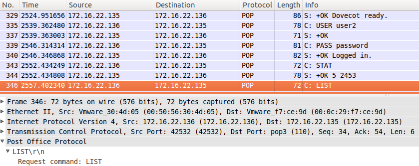

9) Server reply with list of messages


10) Client say that want to see the message No.5


11) Server reply with the message content
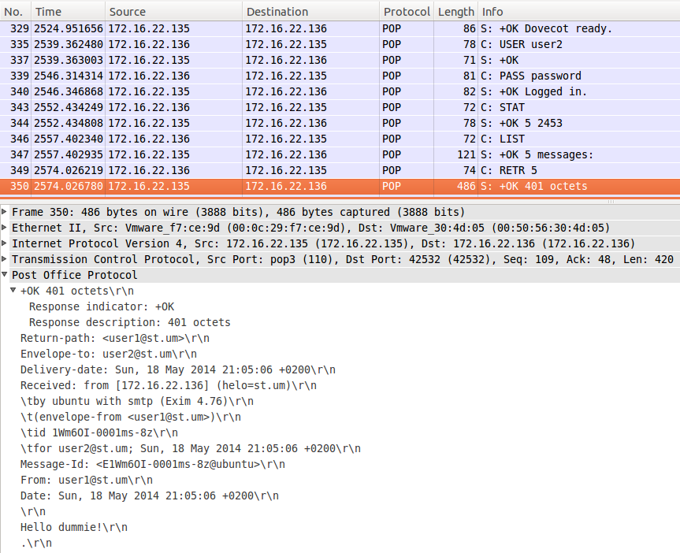

12) Client use DELE command

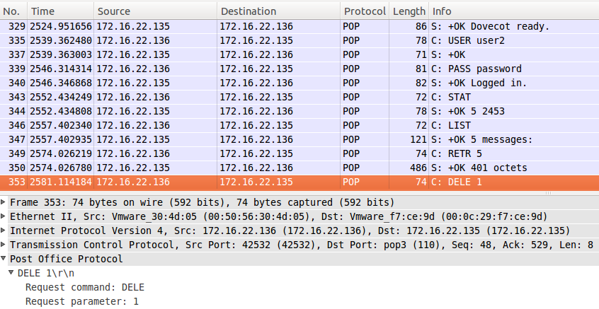

13) Server reply


14) Client use QUIT command for desconnection

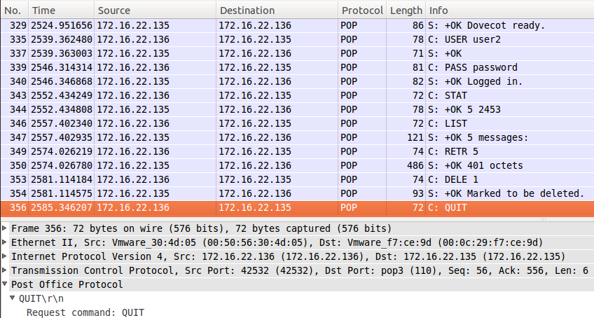

15) Server reply

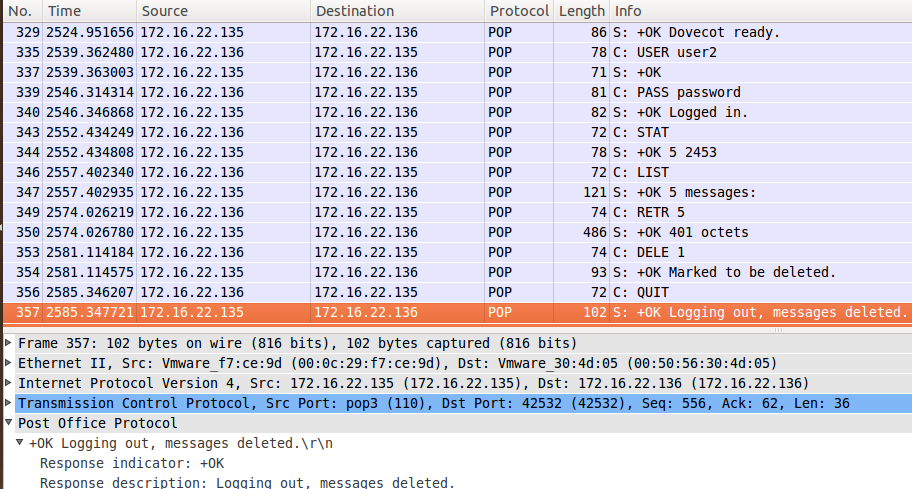
