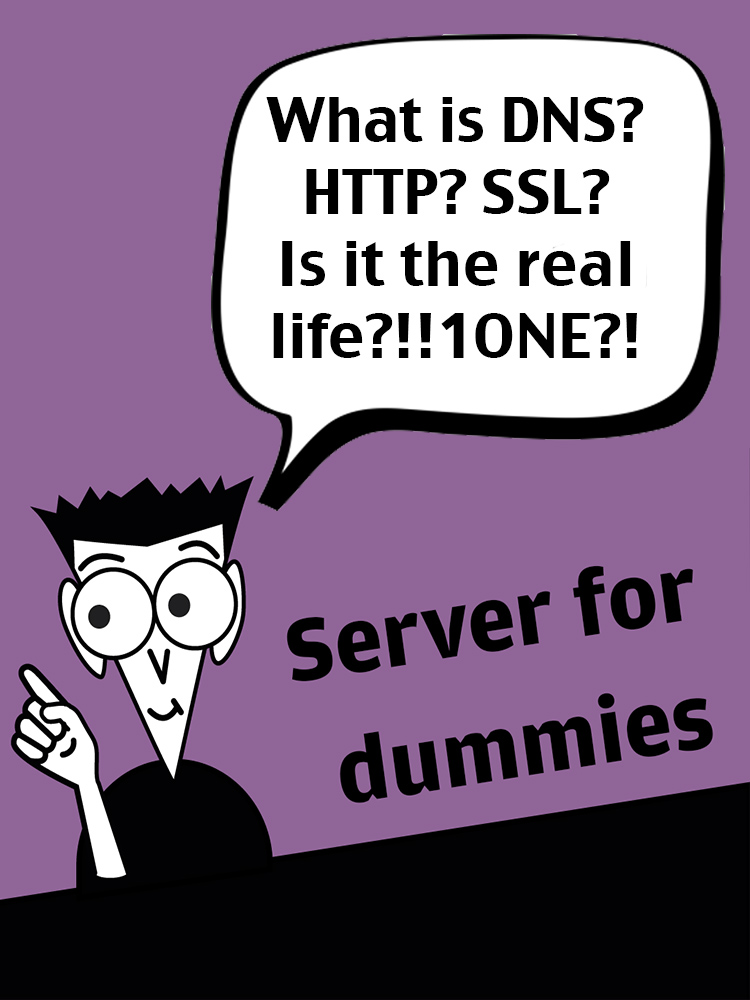
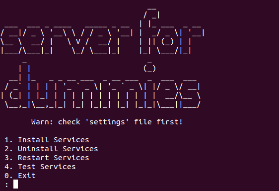
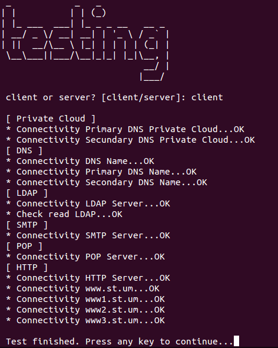

# 1. Get Started




[Online](http://server-dummies.herokuapp.com) | [EPUB](https://github.com/Kikobeats/server-for-dummies/raw/master/dist/epub/server-for-dummies.epub) | [MOBI](https://github.com/Kikobeats/server-for-dummies/raw/master/dist/epub/server-for-dummies.mobi) | [PDF](https://github.com/Kikobeats/server-for-dummies/raw/master/dist/pdf/server-for-dummies.pdf) | [Github](https://github.com/Kikobeats/server-for-dummies)

`server for dummies` is an educational project to understand how typical web services work. It's focused in the application layout services, like:

| Services                     | Transport | Port | Package |
| -----------------------------|:----------|:-----|:--------|
| DNS (Primary and secundary)  | TCP/UDP | 53/UDP <br/> 53/TCP | bind9
| SMTP							| TCP | 25/TCP <br/> 587/TCP (alternative) <br/> 465/TCP (SMTPS) | exim4
| POP3							| TCP | 110/TCP <br/> 995/TCP (encrypted) | dovecot-pop3
| IMAP						    | TCP | 143/TCP <br/> 220/TCP (IMAP3) <br/> 993/TCP (IMAPS) | soon
| LDAP						    | TCP/UDP| 389 (TCP/UDP) | slapd <br/> ldap-utils
| HTTP/HTTPS   				    | TCP | 80 | apache2 <br/> php5
| SSH						    | TCP | 21 | openssh
| FTP						    | TCP | 20/TCP DATA Port <br/> 21/TCP Control Port| soon
| IPSEC						    | | | soon
| TELNET					    | TCP | 23 | soon
| DHCP							| UDP | 67 (server) <br/>68 (client) | soon

For installing all services and get ready your machine for the action, this project has a repository with the original source coude and it is available for everyone.

Have fun!

**NOTE:** This is only a educational example. Don't use in production.

## 1.1 How to use

1) Clone the repo:

`git clone https://github.com/Kikobeats/server-for-dummies.git`

2) go to folder `server-for-dummies` and edit `settings.sh` with your options:

```
## DNS Settings
DNS_NAME="st.um"
PRIMARY_DNS="172.16.22.135"
SECONDARY_DNS="172.16.22.137"
FORWARDERS="155.54.1.10;"

## SMTP Settings
LOCAL_NETWORK="172.16.22.0/24"
RELAY_DOMAINS="$DNS_NAME; um.es"

## OPENSSL Settings
USERNAME="josefranciscoverdugambin"
```

3) Run it with admin account!

`sudo sh init.sh`



## 1.2 Test services

All services have been tested in VM VMWare under Ubuntu Server 12.04:

* VM 1 – Main client
* VM 2 – Primary DNS
* VM 3 – Secondary DNS

For test services connectivity run 'Test services'




## 1.3 Examples

Include:

* 3 example of domains
	* www1.st.um – Basic domain
	* www2.st.um – Domain with HTTP authentication ([authorized users here](https://github.com/Kikobeats/server-for-dummies/blob/master/Services/HTTP/groups))
	* www3.st.um – Domain with HTTPS (check you are visiting https in the browser!)

* 2 mails accounts examples
	* run `./Services/Mail/account.sh` to create it at first time

* LDAP
	* Sample data for check read and modify operations ([check here](https://github.com/Kikobeats/server-for-dummies/tree/master/Services/LDAP))


### 1.3.1 Example SSL


### 1.3.2 Example Mails


### 1.3.3 Example SSH


