# 1. Get Started

| Service 	| Transport 	| Port                  	| Package 	|
|---------	|-----------	|-----------------------	|---------	|
| DNS     	| TCP/UDP   	| 53/UDP                	| bind9   	|
|         	|           	| 53/TCP                	|         	|
| SMTP    	| TCP       	| 25/TCP                	| exim4   	|
|         	|           	| 587/TCP (alternative) 	|         	|
|         	|           	| 465/TCP (SMTP)        	|         	|
| POP3    	| TCP       	| 110/TCP               	| dovecot 	|
|         	|           	| 995/TCP (encrypted)   	|         	|
| IMAP    	| TCP       	| 143/TCP               	| -       	|
|         	|           	| 220/TCP (IMAP3)       	|         	|
|         	|           	| 993/TCP (IMAPS)       	|         	|
| LDAP    	| TCP/UDP   	| 389/TCP               	| slapd   	|
|         	|           	| 389/UDP               	|         	|
| HTTP    	| TCP       	| 80/TCP                	| apache  	|
| SSH     	| TCP       	| 21/TCP                	| openssh 	|
| FTP     	| TCP       	| 20/TCP (Server DT)        | -       	|
|         	|           	| 21/TCP (Server PI)        |         	|
| IPSEC   	| -         	| -                     	| -       	|
| TELNET  	| TCP       	| 23/TCP                	| -       	|
| DHCP    	| UDP       	| 67/UDP (client)       	| -       	|
|         	|           	| 68/UDP (server)       	|        	|

# Install the script

For each machine yo need to install the script. The steps to install the scripts are very easy.

1) Open a terminal and go to a `PATH` for store the script. `cd $HOME` path is a good place.

2) Clone the repository from Github

````
git clone https://github.com/Kikobeats/server-sandbox.git server-sandbox
````


Now is the moment to clone one virtual machine in two more :-)


2) Join in the folder with `cd server-sandbox` and edit `settings.sh` with your favorite editor. (If you haven't idea, you can use `gedit settings.sh`)

This are the following options:

```
## DNS Settings
DNS_NAME="st.um"
PRIMARY_DNS="172.16.22.135"
SECONDARY_DNS="172.16.22.137"
FORWARDERS=""

## SMTP Settings
LOCAL_NETWORK="172.16.22.0/24"
RELAY_DOMAINS="$DNS_NAME; um.es"

## OPENSSL Settings
USERNAME="josefranciscoverdugambin"
```

Set the values:

* **DNS_NAME**: Name that you can use for you DNS. We are use `st.um` but you can use others like `server.dummie`, `server.dev` or whatever.


* **PRIMARY_DNS**: IP of your primary server. You know it using `ifconfig` command in terminal (In my case `eth0` correspond to private network adapter).


* **SECONDARY_DNS**: Like `PRIMARY_DNS` but of your secondary server.


* **FORWARDERS**: IP of the DNS used to resend the DNS query if we can't resolve it. You can use [Google open DNS](https://developers.google.com/speed/public-dns/?hl=es) for this (`8.8.8.8` and `8.8.4.4`).


* **LOCAL_NETWORK**: IP of the network used by VMWare/VirtualBox in the private network. You know this, see the IP's of the primary and secondary and the netmask. If your netmask is `255.55.555.0` you have a **Class C Network** and the network IP is `xxx.xxx.xxx.0/24`.


* **RELAY_DOMAINS**: Valid names for custom mails names.


* **USERNAME**: The username of your virtual machine account used to check the validity of the certificate.


3) Run the script with administrator privileges `sudo sh init.sh`

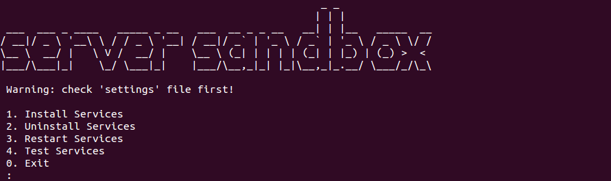

# Extra installation

In the Mail service, the mail account is associate with mail user account in the machine. For testing the mail, we recommended you create two accounts in the primary server. You can run:

````
sh ./Services/Mail/account
````

to create **user1** and **user2** accounts.

# Configure sandbox

We are going to use 3 virtual machines for learn how to web services works.

The schema is formed by:

* **Virtual machine 1** – Main client
* **Virtual machine 2** – Primary DNS
* **Virtual machine 3** – Secondary DNS

We going to **[VMWare software](http://www.vmware.com/products/fusion/features)**. You can download a free version of 30 days.

Its possible that you can use [VirtualBox](https://www.virtualbox.org). If you try with this, please feel free to send us a [feedback](https://github.com/Kikobeats/server-for-dummies/issues) :-)

About the machines, we are used the [lastest stable LTS version of Ubuntu](https://wiki.ubuntu.com/LTS). In own case, **Ubuntu 12.04**. You can this in the [Ubuntu Official Website](http://www.ubuntu.com) and you can use Windows, Linux or Mac for this.

# Configure network adapter in virtual machines

This step is important because we need to simulate that the machines are connected to each.

For configure this select the virtual machine and going to `Settings` > `Removable Devices` section.

You must have a primary `Network Adapter`:

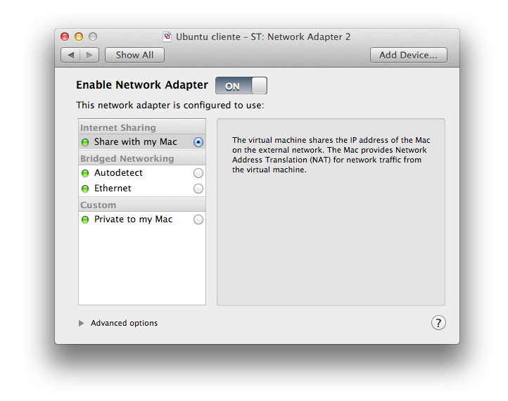


But need to added other adapter too this. Go to button `Add Device`, select `Network Adapter` and configure it like `private`


Is necessary that you do it in the three machines. I recommended you install and configure one and later clone it in two more, but first wait to read `Install the script` section and you haven't the install the script thrice.

# Test services

You can know if all services are run fine with `4. Test Services` option in the script.

After you have selected the option you must indicate if you want run the tests in the `client` or in the `server`.

In the `client`:

* Check if **private cloud** works fine.
* Check if **server services** are accessible with `ping` command.
* Check if is possible search in the **LDAP** service.

In the `server`:

* Check if **DNS config file** is correct.
* Check if **DNS database file** is correct.
* Check if is possible search locally in the **LDAP** service.


# Sample data

For testing services we added sample data for the follow services:

## HTTP

Dividided in:
* www1.st.um – Basic domain
* www2.st.um – Domain with HTTP authentication ([authorized users here](https://github.com/Kikobeats/server-for-dummies/blob/master/Services/HTTP/groups))
* www3.st.um – Domain with HTTPS (check you are visiting https in the browser! automatic redirect isn't activated).

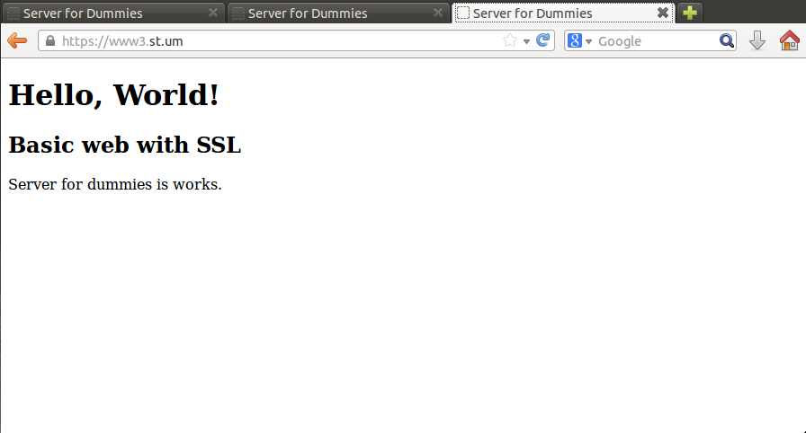

## Mail

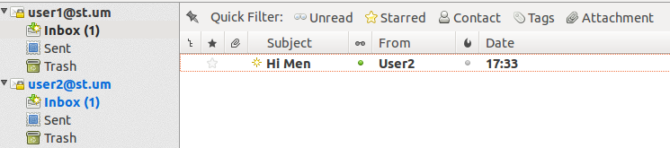

*(remember run `./Services/Mail/account.sh` to create it at first time in the primary server).*

## LDAP


*Sample data for check read and modify operations ([check here](https://github.com/Kikobeats/server-for-dummies/tree/master/Services/LDAP))*

## SSH

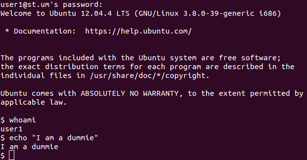


# Understand

Internet is the best invent in the last 50 years, and maybe someone can say that is the best invention in the world.

First, relax. Internet is not perfect and needs much human value to make it a secure service for daily things, for example, reading your mail, visiting a cats' website, downloading creative commons music and films...

Internet is nested in layers called [OSI model](https://en.wikipedia.org/wiki/OSI_model). Seven layers compound the OSI model and each layer offers services for differents things.


Top-level layers need their lower layer to offer a service. Your browser doesn't load a website if its transfer protocol doesn't work correctly.

Other important networks elements are routers, switches and host and using different protocols (BGP, RIP, OSPF) to communicate with each one and make internet a network of computers that understands how a package travles from EEUU to Spain.

But this is not important here. You'll need to understand how to set up your machine to be accesible for the others and to offer your services for resolving names, having mails accounts under your domain...

The services that you intend to use belong to the application layer. As I said before, this services use services or protocols of lower layers of the OSI model. For example, DNS is an aplication service, but it needs a transport protocol to resolve name to IP. By the other hand, IP is based on network layer IPv4 (or better, IPv6) to be operative for the application layer.

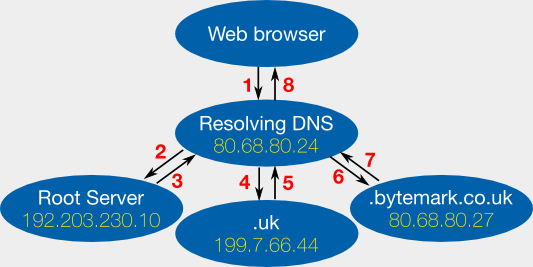

At the end, all is a stack of abstraction. The purpose is having an application layer available, secure and operative.

Now, is time to take action!

# Important files

**DNS**

* `/etc/resolv.conf`</br>


* `/etc/bind/named.conf.options`</br>


* `/etc/bind/named.conf.local`</br>


* `/etc/bind/db."$DNS_NAME".zone`</br>

**SMTP**

* `/etc/exim4/update-exim4.conf.conf`</br>
Exim4 settings

**POP**

* `/etc/dovecot/conf.d/10-mail.conf`</br>
Dovecot settings


* `/etc/dovecot/conf.d/10-auth.conf`</br>
Dovecot settings

**LDAP**

* `ldapmodify -Y EXTERNAL -H ldapi:/// -f FILE`</br>
Modify LDAP settings


* `ldapadd -Y EXTERNAL -H ldapi:/// -f FILE`</br>
Load database data

**HTTP**

* `/etc/apache2/sites-available`</br>
Apache virtual hosts


* `/var/www/`</br>
Apache websites data


* `/etc/apache2/groups`</br>
Apache authentication

**SSL**

* `usr/lib/ssl/openssl.cnf`</br>
Configuration file of SSL

**SSH**

* `~/.ssh`</br>
Content SSH keys

# Common commands

**General**

* `netstat -a | more` </br>
show ports and services that you are using.


* `ifconfig`</br>
Know network options.


**DNS**

* `dig www.domain.com`</br>
Do DNS query.


* `host www.domain.com`</br>
Know the IP of a name.


* `nslookup www.domain.com`</br>
Check if DNS is resolve correctly.

**SMTP**

* `telnet xxx.xxx.xxx.xxx 25` </br>
Basic query to SMTP service.

**POP**

* `telnet xxx.xxx.xxx.xxx 110` </br>
Basic query to POP service.

**LDAP**

* `ldapsearch -x -H ldap://LDAP_IP -b "cn='',ou='',o='',c=''" FIELD` </br>
Search in the LDAP IP.

**HTTP**

*  `curl -I www.domain.com` </br>
Get HTTP head of the response.

**SSL**

* `openssl version -d` </br>
Report your SSL directory


* `openssl req -x509 -newkey rsa:2048 -keyout cakey.pem -days 3650 -out cacert.pem` Generate CA autosign in the server


* `openssl x509 -in cacert.perm -text` </br>
Check that your server certificate is standard by x509


* `openssl rsa -in cakey.perm -text` </br>
Check taht your server certificate is RSA correct


* `openssl req -new -nodes -newkey rsa:1024 -keyout serverkey.pem -out servercsr.pem` </br> Generate certificate client


* `openssl ca –keyfile cakey.pem -in servercsr.pem -out servercert.pem` </br>
Sign certificate client by the server


* `openssl s_server -cert servercert.pem -key serverkey.pem -www` </br>
Check that your client certificate is valid


# DHCP

The Dynamic Host Configuration Protocol (*DHCP*) is a standardized networking protocol used on Internet Protocol (IP) networks for dynamically distributing network configuration parameters, such as IP addresses for interfaces and services. With DHCP, computers request IP addresses and networking parameters automatically from a DHCP server, reducing the need for a network administrator or a user to configure these settings manually.


Normally is necessary that DHCP is in the same network, but is possible to set this in external network using **DHCP relay** like proxy:

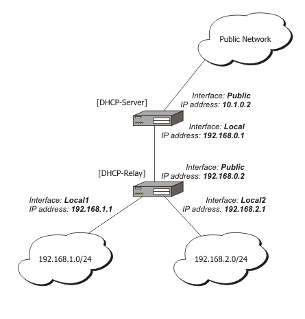

The different message for DHCP protocol are:

<table>
<tbody><tr><th>
<p>
Message Type</p>
</th><th>
<p>
Description</p>
</th></tr>
<tr><td>
<p>
DHCPDiscover</p>
</td><td>
<p>
The first time a DHCP client computer attempts to log on to the network, it requests IP address information from a DHCP server by broadcasting a DHCPDiscover packet. The source IP address in the packet is 0.0.0.0 because the client does not yet have an IP address. The message is either 342 or 576 bytes long—older versions of Windows use a longer message frame.</p>
</td></tr>
<tr><td>
<p>
DHCPOffer</p>
</td><td>
<p>
Each DHCP server that receives the client DHCPDiscover packet responds with a DHCPOffer packet containing an unleased IP address and additional TCP/IP configuration information, such as the subnet mask and default gateway. More than one DHCP server can respond with a DHCPOffer packet. The client will accept the first DHCPOffer packet it receives. The message is 342 bytes long.</p>
</td></tr>
<tr><td>
<p>
DHCPRequest</p>
</td><td>
<p>
When a DHCP client receives a DHCPOffer packet, it responds by broadcasting a DHCPRequest packet that contains the offered IP address, and shows acceptance of the offered IP address. The message is either 342 or 576 bytes long, depending on the length of the corresponding DHCPDiscover message.</p>
</td></tr>
<tr><td>
<p>
DHCPAcknowledge (DHCPAck)</p>
</td><td>
<p>
The selected DHCP server acknowledges the client DHCPRequest for the IP address by sending a DHCPAck packet. At this time the server also forwards any optional configuration parameters. Upon receipt of the DHCPAck, the client can participate on the TCP/IP network and complete its system startup. The message is 342 bytes long.</p>
</td></tr>
<tr><td>
<p>
DHCPNak</p>
</td><td>
<p>
If the IP address cannot be used by the client because it is no longer valid or is now used by another computer, the DHCP server responds with a DHCPNak packet, and the client must begin the lease process again. Whenever a DHCP server receives a request for an IP address that is invalid according to the scopes that it is configured with, it sends a DHCPNak message to the client.</p>
</td></tr>
<tr><td>
<p>
DHCPDecline</p>
</td><td>
<p>
If the DHCP client determines the offered configuration parameters are invalid, it sends a DHCPDecline packet to the server, and the client must begin the lease process again.</p>
</td></tr>
<tr><td>
<p>
DHCPRelease</p>
</td><td>
<p>
A DHCP client sends a DHCPRelease packet to the server to release the IP address and cancel any remaining lease.</p>
</td></tr>
<tr><td>
<p>
DHCPInform</p>
</td><td>
<p>
DHCPInform is a new DHCP message type, defined in RFC&nbsp;2131, used by computers on the network to request and obtain information from a DHCP server for use in their local configuration. When this message type is used, the sender is already externally configured for its IP address on the network, which may or may not have been obtained using DHCP. This message type is not currently supported by the DHCP service provided in earlier versions of Windows&nbsp;NT Server and may not be recognized by third-party implementations of DHCP software. </p>
</td></tr>
</tbody></table>

Simply process in one image:

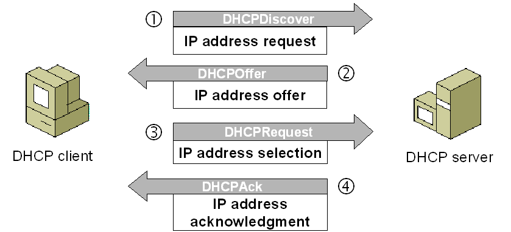

# DNS

DNS is one of the most important services for internet because is necessary to convert a name of one web in its IP for simply question: Remember a IP is very most difficult that remember a name.

At first for to do it the first computers had a simply file called `host.txt` that works similar to key/value dictionary: One name have one IP translation. And one of this old computers is used to serve the HOSTS.txt updated of the rest of old computers. This is the concept.

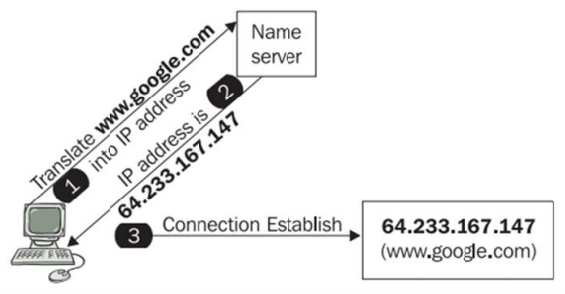

This is simply if you have less than 10 computers in the world. But now, this is a bit complicated with too much computers.

The DNS service is regulated by the [ICANN since 1988](https://en.wikipedia.org/wiki/ICANN).

Basically for understand how ICANN regulated it you must know that she designates a root nodes to keep all information about how to resolve whatever domain. When you go to website to register a website name, actually you are recording your domain in the ICANN nodes.


Each domain have different **records** for the dommain. A record is the basic data component in DNS. Resource records define not only names and IP addresses but domains, servers, zone, and services as well. This list shows you the most common types of resource records:

<table>
<tbody><tr>
<th>Type</th>
<th>Purpose</th>
</tr>
<tr>
<td><b>A</b></td>
<td><i>Address</i> resource records match an IP address to a host
name.</td>
</tr>
<tr>
<td><b>CNAME</b></td>
<td><i>Canonical name</i> resource records associate a nickname to
a host name.</td>
</tr>
<tr>
<td><b>MX</b></td>
<td><i>Mail exchange</i> resource records identify mail servers for
the specified domain.</td>
</tr>
<tr>
<td><b>NS</b> <b></b></td>
<td><i>Name server</i> resource records identify servers (other
than the SOA server) that contain zone information files.</td>
</tr>
<tr>
<td><b>PTR</b> </td>
<td><i>Pointer resource</i> records match a host name to a given IP
address. This is the opposite of an Address record, which matches
an IP address to the supplied host name.</td>
</tr>
<tr>
<td><b>SOA</b></td>
<td><i>Start of authority</i> resource records specify which server
contains the zone file for a domain.</td>
</tr>
<tr>
<td><b>SRV</b> </td>
<td><i>Service</i> resource records identify servers that provide
special services to the domain.</td>
</tr>
</tbody></table>

## DNS Query

The better way to explain the process is with a example.

You need to know the resolve of `www.google.com` domain.

### Iterative Query

* Client query here local DNS. (1) 
* If the local DNS don't know the domain, answer the root nameserver. (2)
* Root Nameserves indicate the node that have `.com` > `google` register.
* Local DNS talk with the node and obtain the DNS authority nameserver. (4)(5)
* Local DNS contact with DNS authority nameserver for resolve `www`
* DNS authority nameserver respond local DNS.


This is normally to process to resolve a query.

### Recursive Query

The process with recusive query is similar, but now the DNS local doesn't handle all calls: The DNS servers delegate in others DNS server to resolve the query.

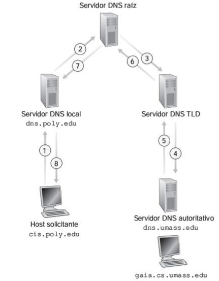

## DNS Respond

The server that respond the query is indicate in the **AA** (*Authoritative Answer*). Its possible that for each zone have more than one DNS name server. This is known as **Primary** and **Secondary** DNS of the zone and data redundancy is a measure of safety and reliability.

In easy see this in the DNS response message:

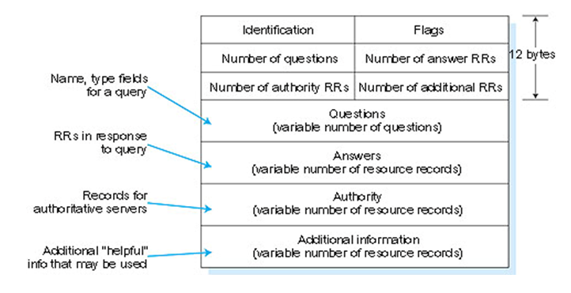

# Your DNS in the client

You need to say at your client that use your DNS to resolve names. Run the script and select this options:

```
1. Install Services > client > DNS
```


This is translate in the script to write in your client the IP of your primary DNS in the system file `/etc/resolv.conf` that is used to resolve queries:

```
echo " * Configuring DNS client..."
echo "# Dynamic resolv.conf(5) file for glibc resolver(3) generated by resolvconf(8)
# DO NOT EDIT THIS FILE BY HAND -- YOUR CHANGES WILL BE OVERWRITTEN
nameserver $PRIMARY_DNS
nameserver $SECONDARY_DNS
#search localdomain
" > /etc/resolv.conf
```

You can check connectivity in the client with two commands, both in the client:


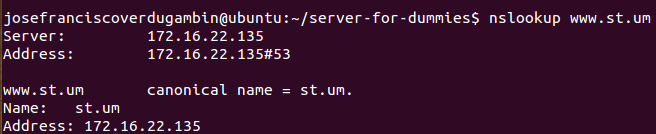

# Your DNS in the server

Server configuration is also simple, but it requires a few extra steps.

```
1. Install Services > client > DNS > [Select primary or secondary]
```


## Primary DNS

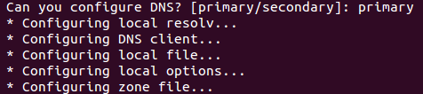


1. Install **bind9**, a application to provide DNS services
2. Edit `/etc/resolv.conf` file and add your own direction
3. Set up **bind9** to define your domain database and your secondary IP if is defined.

```
write_config_local_server(){
echo "zone \"$DNS_NAME.\" IN {
  type master;
  file \"/etc/bind/db.$DNS_NAME.zone\";
  allow-transfer {$SECONDARY_DNS;};
  }; " > /etc/bind/named.conf.local
}
```

4. In the domain database write entries to be resolubles main services that use DNS to access it:

```
write_database(){
echo "\$TTL  604800
@ IN  SOA ns1.$DNS_NAME. root.ns1.$DNS_NAME. (
            1   ; Serial
       604800   ; Refresh
        86400   ; Retry
      2419200   ; Expire
       604800 ) ; Negative Cache TTL

@             IN      NS         ns1.$DNS_NAME.
ns1           IN      A          $PRIMARY_DNS
@             IN      NS         ns2.$DNS_NAME.

ns2           IN      A          $SECONDARY_DNS
$DNS_NAME.    IN      A          $PRIMARY_DNS

smtp          IN      CNAME      $DNS_NAME.
pop3          IN      CNAME      $DNS_NAME.
ldap          IN      CNAME      $DNS_NAME.
www           IN      CNAME      $DNS_NAME.
www1          IN      CNAME      $DNS_NAME.
www2          IN      CNAME      $DNS_NAME.
www3          IN      CNAME      $DNS_NAME.
" > /etc/bind/db."$DNS_NAME".zone
}
```

## Secondary DNS

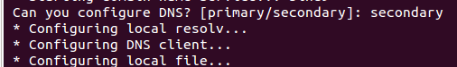

For the secondary server, the configuration is more easy because this use primary server to get information and don't need too more:

```
write_config_local_client(){
echo "zone \"$DNS_NAME.\" IN {
  type slave;
  file \"/var/cache/bind/db.$DNS_NAME.zone\";
  masters {$PRIMARY_DNS;};
};
" > /etc/bind/named.conf.local
}
```

# How DNS works


## Internal query

For the example, I run `dig st.um` command and see in the wireshark what happens:

The client do standard query connection at default DNS server (my server). In the header I say that I want to translate `st.um` adress (of type `A`)

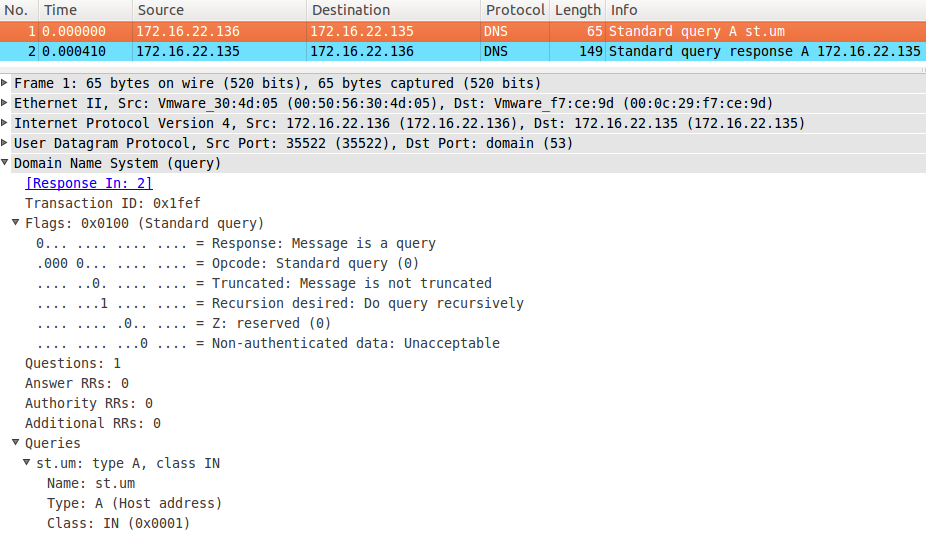

The server respond me with same useful information: 
* In `Answer` section, server response my query and say 'Hey, the register A of the domain is `172.16.22.135.`
* In `AA nameserver` section indicate what server responde the query. In this case, my primary (`ns1.st.um`) and secondary (`ns2.st.um`) server.
* In `Additional Record` section indicate additional information like the IP of the nameservers.

. In the `answer` entry of the header you can see the IP of my request name, and the adress of the DNS server that serve the information:

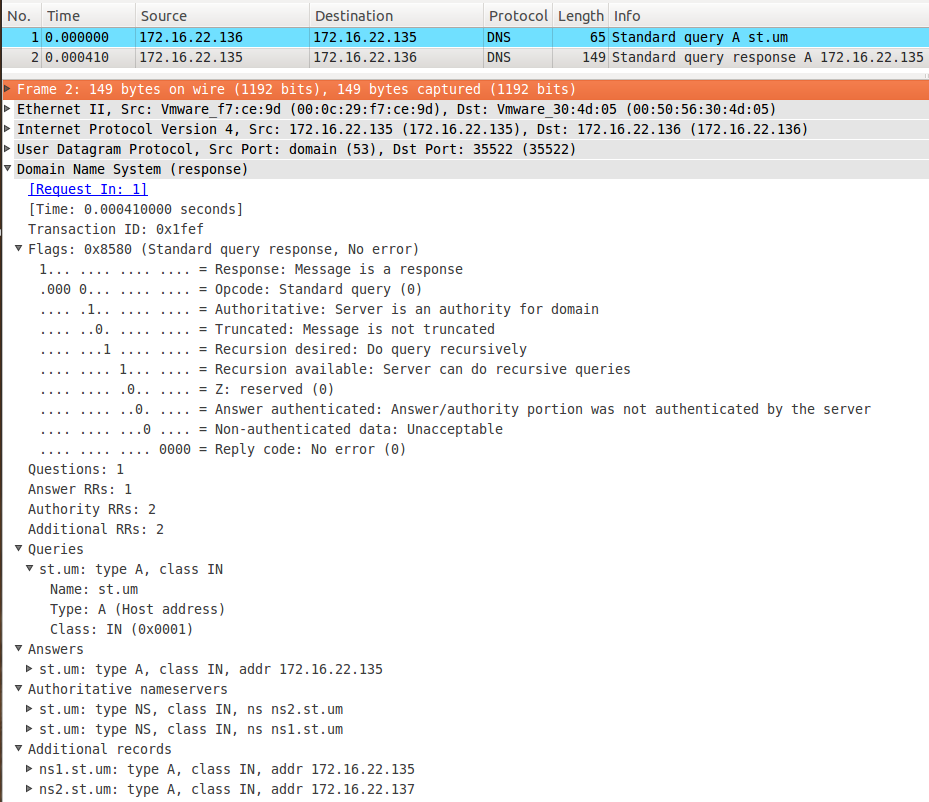

## External query

This process is similar to internal query, but now depend of external DNS.

In this case, I do a `ping google.com` and in this process I need first translate `google.com` name into a IP name:

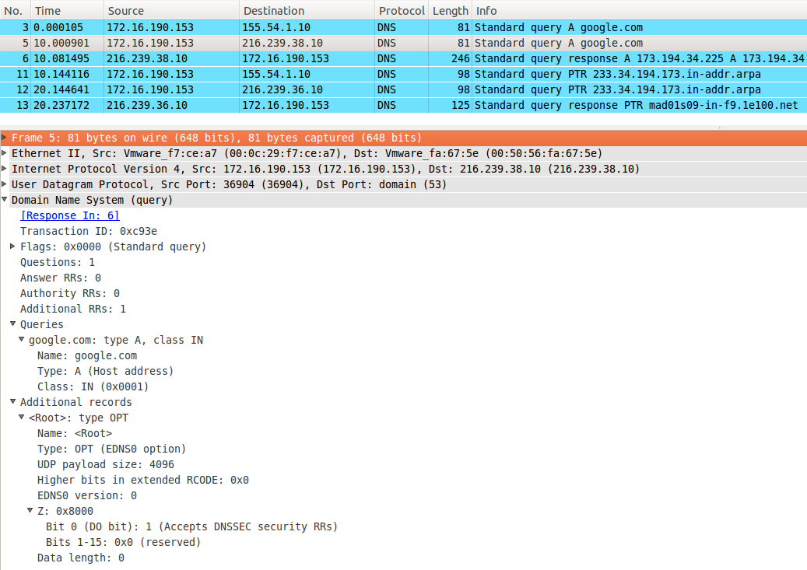

The DNS server respond me with a list of availables IPs for `google.com` domain:

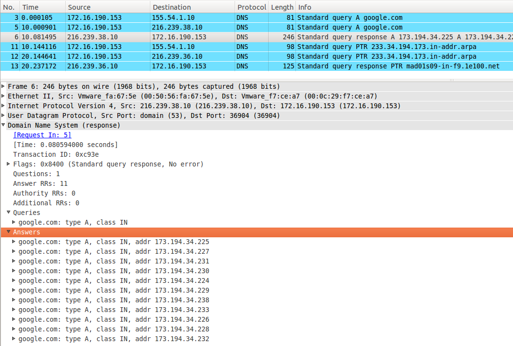

Now, I can continue with my ping!

# FTP

The **File Transfer Protocol** (*FTP*) is a standard network protocol used to transfer computer files from one host to another host over a TCP-based network, such as the Internet.

The FTP protocol is divided in two ways: **Protcol interpreter** and **data transfer process**.

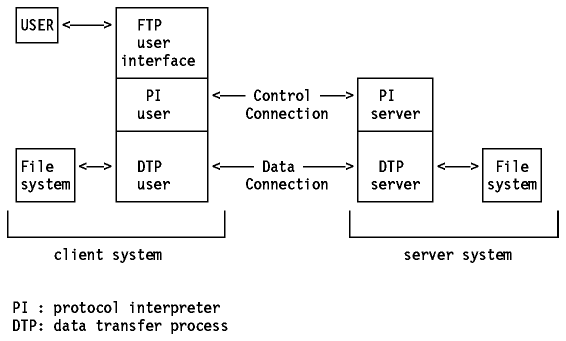

In the client, the ports for PI and DTP are not established. Can be any free port. In the server is typical use 21 and 20 port respectively.
Aslo, FTP can work in two modes:

**FTP in Active mode**

In active mode, the client have to open a port to communicate with the server.

* Client init connection with server PI and send command `PORT` to indicate the port that server need to init a TCP connection.
* Server create TCP connection and delegate in DTP to send the data.

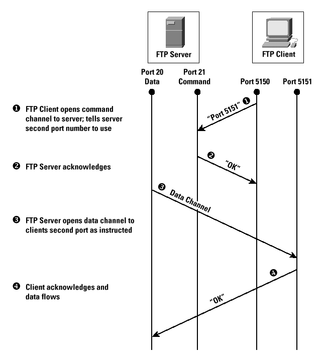

This mode has two inconvenients:

* The client connection is not secure. Client have to accept all trafic in the port of the data, and this is very dangerous.
* Don't work fine if client have a firewall.

**FTP in Passive mode**

The idea is fix problem in active mode. In this case, the client negotiate the TCP connection with the server and say him that open a port for transfer data.

* The process is similar to Active mode but in the case client send the command `PASV` to indicate passive mode and the server response with the number of port that can be use. (>1024).
* The client init the TCP connection with the server port.


<table class="ccm" cellspacing="0" cellpadding="0" width="550">
<tbody><tr>
<th height="22" colspan="2" width="100%">Access control commands
</th></tr>
<tr>
<th>Command</th>
<th>Description</th>
</tr>
<tr>
<td>USER</td>
<td>Character string allowing the user to be identified. User identification is necessary to establish communication over the data channel.</td>
</tr>
<tr>
<td>PASS</td>
<td>Character string specifying the user's password. This command must immediately precede the <i>USER</i> command. It falls to the client to hide the display of this command for security reasons.</td>
</tr>
<tr>
<td>ACCT</td>
<td>Character string representing the user's account. The command is generally not necessary. During the response accepting the password, if the response is 230 this stage is not necessary, if the response is 332, it is.</td>
</tr>
<tr>
<td>CWD</td>
<td><i>Change Working Directory</i>: this command enables the current directory to be changed. This command requires the directory's access path

to be fulfilled as an argument.</td>
</tr>
<tr>
<td>CDUP</td>
<td><i>Change to Parent Directory</i>: this command allows you to go back to the parent directory. It was introduced to solve problems of naming the parent directory according to the system (generally "<i>..</i>").</td>
</tr>
<tr>
<td>SMNT</td>
<td><i>Structure Mount</i>: </td>
</tr>
<tr>
<td>REIN</td>
<td><i>Reinitialize</i>: </td>
</tr>
<tr>
<td>QUIT</td>
<td>Command enabling the current session to be terminated. The server waits to finish the transfer in progress if the need arises, then supplies a response before closing the connection.</td>
</tr>
</tbody></table>

<table class="ccm" cellspacing="0" cellpadding="0" width="550">
<tbody><tr>
<th height="22" colspan="2" width="100%">Transfer parameter commands
</th></tr>
<tr>
<th>Command</th>
<th>Description</th>
</tr>
<tr>
<td>PORT</td>
<td>Character string allowing the port number used to be specified.</td>
</tr>
<tr>
<td>PASV</td>
<td>Command making it possible to indicate to the DTP server to stand by for a connection on a specific port chosen randomly from among the available ports. The response to this command is the IP address of the machine and port.</td>
</tr>
<tr>
<td>TYPE</td>
<td>This command enables the type of format in which the data will be sent to be specified.</td>
</tr>
<tr>
<td>STRU</td>
<td>Telnet character specifying the file structure (F for <i>File</i>, R for <i>Record</i>, P for <i>Page</i>).</td>
</tr>
<tr>
<td>MODE</td>
<td>Telnet character specifying data transfer method (S for <i>Stream</i>, B for <i>Block</i>, C for <i>Compressed</i>).</td>
</tr>
</tbody></table>

# HTTP

HTTP (short for *HyperText Transfer Protocol*) is the underlying protocol used by the World Wide Web. HTTP defines how messages are formatted and transmitted, and what actions Web servers and browsers should take in response to various commands. For example, when you enter a URL in your browser, this actually sends an HTTP command to the Web server directing it to fetch and transmit the requested Web page.

All parameter of the protocol are specified in the **HTTP header**

Client Request:

```
GET /index.html HTTP/1.1
Host: www.example.com
```

Server Response:

```
HTTP/1.1 200 OK
Date: Mon, 23 May 2005 22:38:34 GMT
Server: Apache/1.3.3.7 (Unix) (Red-Hat/Linux)
Last-Modified: Wed, 08 Jan 2003 23:11:55 GMT
ETag: "3f80f-1b6-3e1cb03b"
Content-Type: text/html; charset=UTF-8
Content-Length: 131
Accept-Ranges: bytes
Connection: close

<html>
<head>
  <title>An Example Page</title>
</head>
<body>
  Hello World, this is a very simple HTML document.
</body>
</html>
```


A message in HTTP have 3 parts:

1. First line with *HTTP_Method*, *Resource ID* adn  *HTTP Version*.
2. Information about the client and the petition.
3. Body request if the client need to transfer data to the server.

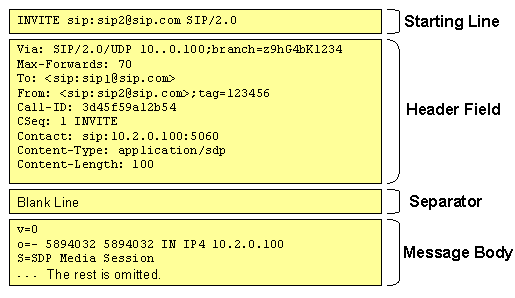

The HTTP methods are different for different actions:


And each client request is response with status code:

* **1xx** Informational
* **2xx** Success
* **3xx** Redirection
* **4xx** Client Error
* **5xx** Server Error

Special mention to:

```
418 I'm a teapot (RFC 2324)
This code was defined in 1998 as one of the traditional IETF April Fools' jokes, in RFC 2324, Hyper Text Coffee Pot Control Protocol, and is not expected to be implemented by actual HTTP servers.
```


# Your HTTP in the client

If you have a browser and/or terminal, you don't need additional things.

When you install your server configuration can check this

## With browser

### HTTP Simple (http://www1.st.um)


### HTTP Simple with authentication (http://www2.st.um)


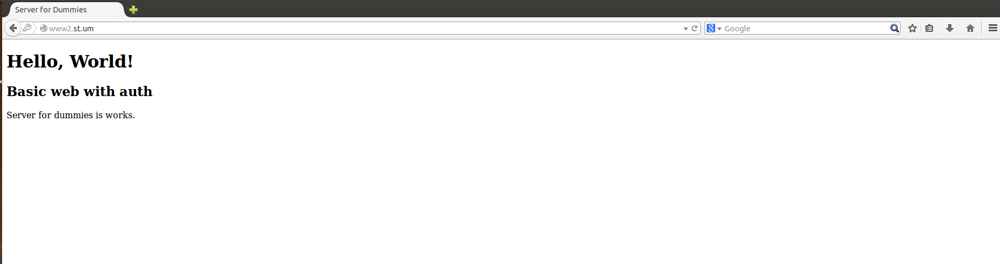

### HTTP with SSL (https://www3.st.um)

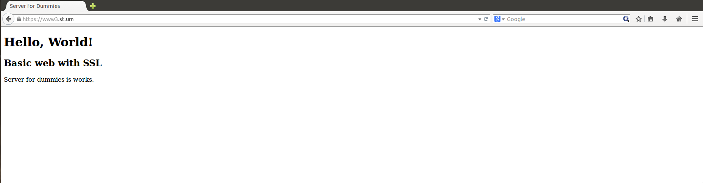

## With terminal

With the browser url access is sufficient, but you need feel like a *hacker*, you can do the same but in terminal

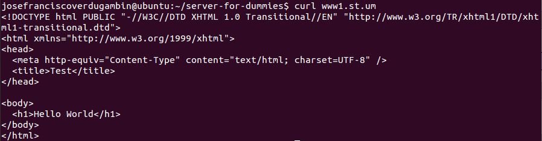


# Your HTTP in the server

We use **apache** and **php** for render dynamic code.

Also, we can configure it to mount different domains separated but under the same machine.

For do it, first need define **virtual hosts**. In the example we use 3 virtual hosts:

* virtual host to www1.st.um and basic website.
* virtual host to www2.st.um and basic apache authentication.
* virtual host to www3.st.um to get a secure HTTP based on SSL certificate (HTTPS).

This files are defined in `Services/example/` and with the script we go to copy differents files to differents folders:

* We copy the files of the virtual hosts `Services/example/vhost` to `/etc/apache2/sites-available`.
* We copy the files of the websites `Services/example/sites` to `/var/www/`.
* We copy the files of the apache authentication methd  `Services/example/groups` to `/etc/apache2/groups`.

The SSL Certificate is a case of study that you will see in SSL Chapter.

# How HTTP works


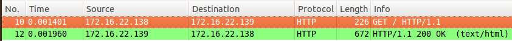

1) HTTP Request (GET Command)

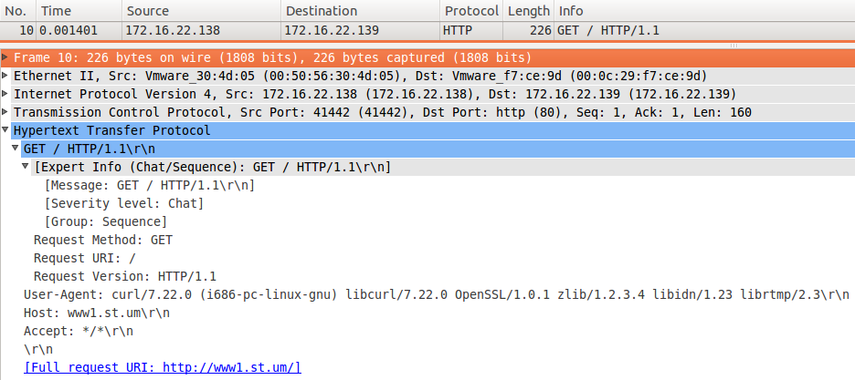

2) HTTP Response (200 OK code status)

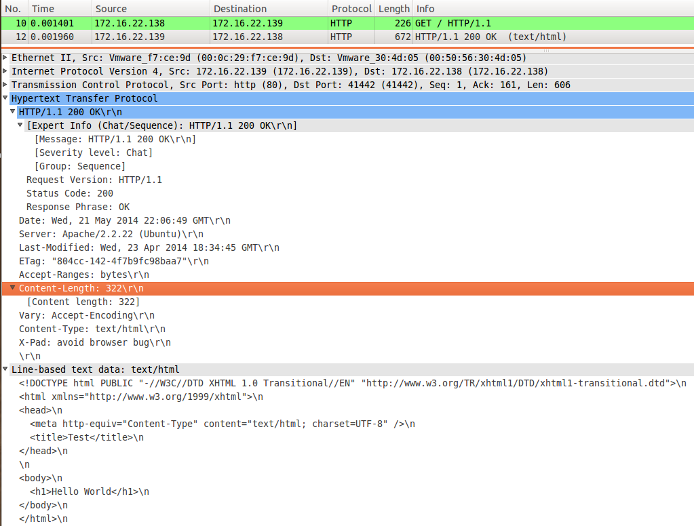

# LDAP

Maybe at this moment you don't know what is a LDAP but maybe use LDAP in the real life.

LDAP *(Lightweight Directory Protocol)* concept is similar to use a address book to annotate information about people around you: Adress, email, work mobile,...

As Internet, LDAP is your adress book. And you can use LDAP for this. Your Adress book online!

LDAP is like database, but is specially designed for queries and put public information about employees of an organization or similar. The tree structure of a LDAP is known as **Directory Information Tree** (*DIT*):


LDAP object are referenced  by its **Distinguished Name** (*DN*). A DN is a sequence of **Relative Distinguished Names** (*RDN*) connected by commas.

An RDN is an attribute with an associated value in the form attribute=value; normally expressed in a UTF-8 string format.

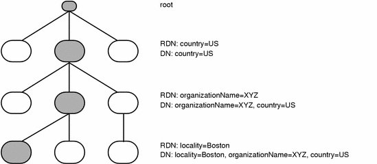


Each entry is a **ObjectClass** that can contain a define type of attributes.

## LDAP Structure

LDAP is structured in entry. The first entry of a LDAP is simulated. 

Typically LDAP have the form of a tree, but not always is it because can be entries that are *alias* of a other entry.

The entry of a LDAP is limited:

* **STRUCTURAL**: Is the ObjectClass that define the entry
* **AUXILIARY**: When the Objectclass is a parent of a other ObjectClass. The *root ObjectClass* is `top`
* **ABSTRACT**: Optional ObjectClass that the entry can be container.

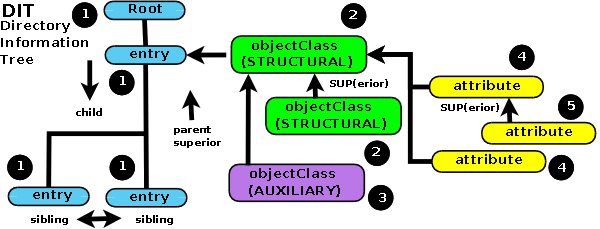

**Commonly Used ObjectClass**

| Type                 | Top                  | Atribute required  | Atribute Optional             |
|----------------------|----------------------|--------------------|-------------------------------|
| top                  |                      | objectClass        |                               |
| alias                | top                  | aliasedObjectClass |                               |
| person               | top                  |                    | description, seeAlso,         |
|                      |                      |                    | telephoneNumber,              |
|                      |                      |                    | userPassword                  |
| organizationalPerson | person               |                    | l, ou, postalAdress,          |
|                      |                      |                    | postalCode, st, street, title |
| inetOrgPerson        | organizationalPerson |                    | jpegPhoto, mail,              |
|                      |                      |                    | uid, o, userCertificate,...   |

**Commonly Used Attributes**

<table>
<tbody><tr><th>String</th><th>Attribute type</th></tr>
<tr><td><strong>DC</strong></td><td>domainComponent</td></tr>
<tr><td><strong>CN</strong></td><td>commonName</td></tr>
<tr><td><strong>OU</strong></td><td>organizationalUnitName</td></tr>
<tr><td><strong>O</strong></td><td>organizationName</td></tr>
<tr><td><strong>STREET</strong></td><td>streetAddress</td></tr>
<tr><td><strong>L</strong></td><td>localityName</td></tr>
<tr><td><strong>ST</strong></td><td>stateOrProvinceName</td></tr>
<tr><td><strong>C</strong></td><td>countryName</td></tr>
<tr><td><strong>UID</strong></td><td>userid</td></tr>
</tbody></table>

# Your LDAP in the client

For search in the LDAP client need to install **ldap-utils** command. Later We can configure your typical mail client (Thunderbild, for example) to search in the LDAP when you need a compose a mail and need to know the destination account.


# Your LDAP in the server

In the server need to install **slapd** service configue the database schema and insert sample data. In this case we have the defintions of the data and the information in the `Services/LDAP/*.dif` files and use `Services/LDAP/server.sh` for boostrapping process.

This is set up when you choice install LDAP:


```
echo " * Installing LDAP..."
apt-get -y install slapd ldap-utils

echo " * Adding LDAP database..."
# Load database
sudo ldapmodify -Y EXTERNAL -H ldapi:/// -f "$DIR"/loadDBD.ldif;

echo " * Loading LDAP example schema..."
# Load database models schema
sudo ldapadd -Y EXTERNAL -H ldapi:/// -f /etc/ldap/schema/inetorgperson.ldif;
sudo ldapadd -Y EXTERNAL -H ldapi:/// -f /etc/ldap/schema/cosine.ldif;

echo " * Adding LDAP custom schema ..."
# Load own schema for the example
sudo ldapadd -Y EXTERNAL -H ldapi:/// -f "$DIR"/stSchema.ldif;

echo " * Configuring LDAP database..."
# Load database configuration
sudo ldapmodify -Y EXTERNAL -H ldapi:/// -f "$DIR"/confDatabase.ldif;

echo " * Inserting LDAP data..."
# Insert fake data for the example
sudo ldapmodify -D "cn=admin,o=um,c=es" -W -H ldap:/// -f "$DIR"/st.ldif;
```

# How LDAP works

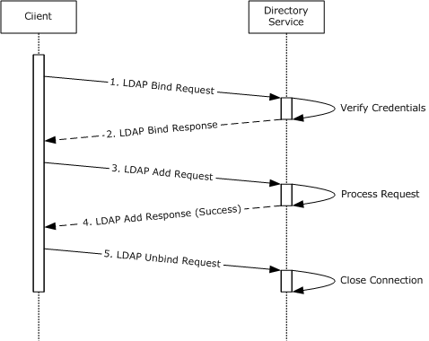

Resume:

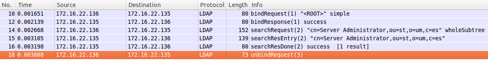

1) BindRequest (Authentication)

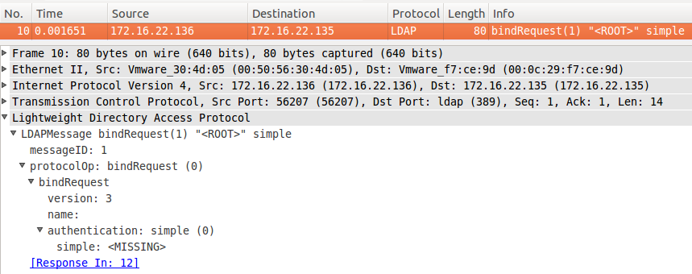

2) BindResponse

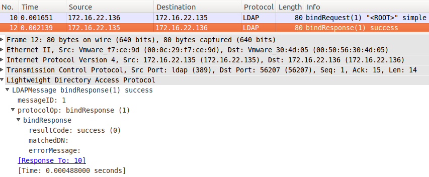

3) SearchRequest

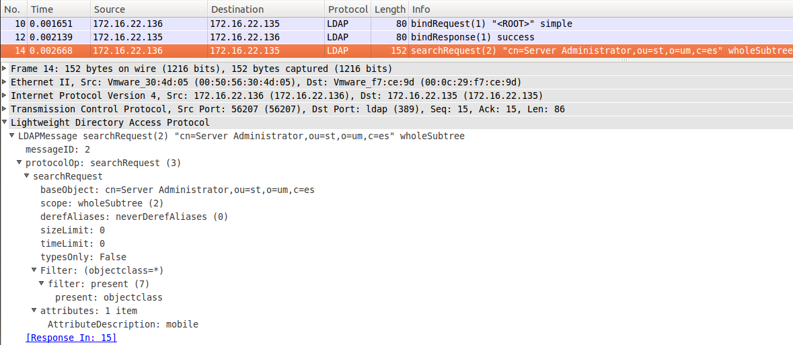

4) SearchResponse

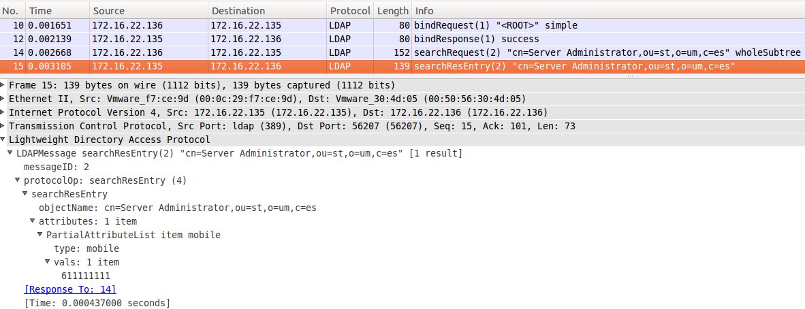

5) SearchDone

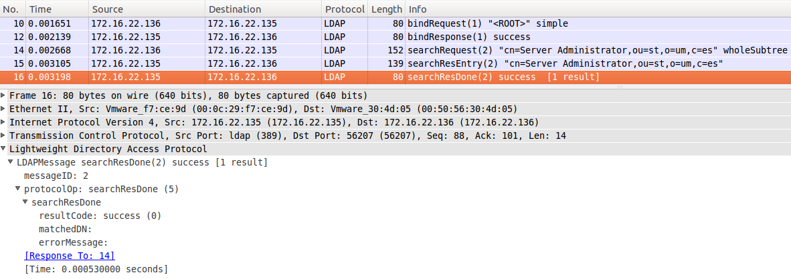

6) unbinRequest

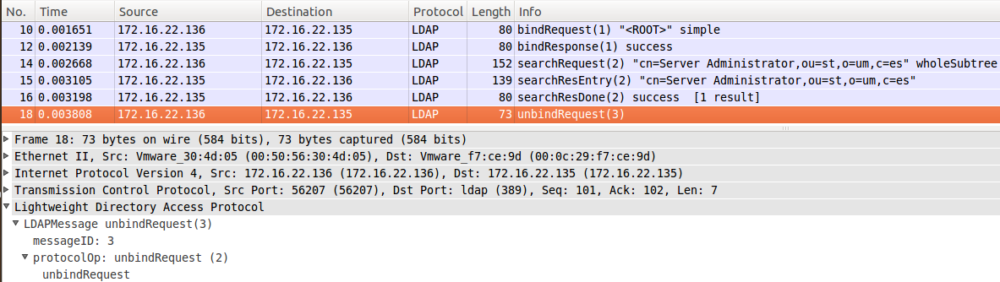

# Mail

Mail is the basic, oldest and most popular service of the internet.

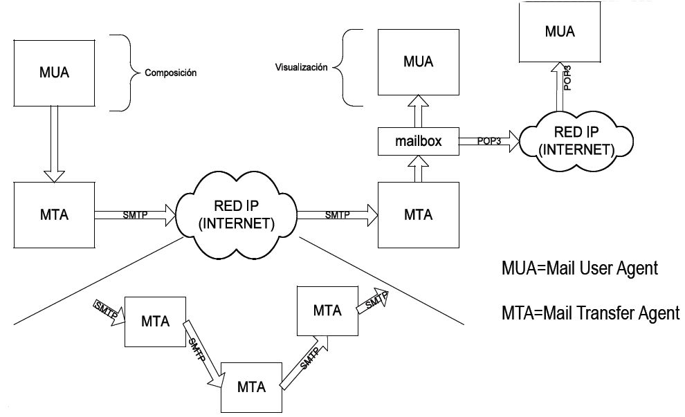

When you want to send a mail, you going to deposit the mail in the receive mailbox of the receiver, but have a little problem: don't know the adress of the destination mailbox.

For know it, you need to use DNS query of the server name of the mailbox adress, and he say you the direction where you cand send the mail. And also the process is similar when you want to check your mail account. You can see this more later when We analyze the traffic with wireshark.

For support mail, you need support DNS before. This is because mail is based on mailbox concept: All mail accounts need a mailbox for send (**SMTP**) and receive (**POP3** or **IMAP**).

**SMTP**

Define the protocol necessary that transmit the message to the mailbox.

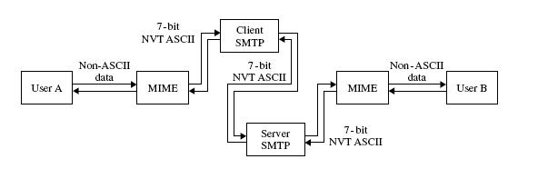

The options about how the message have to be interpreted is described in the **MIME** header.

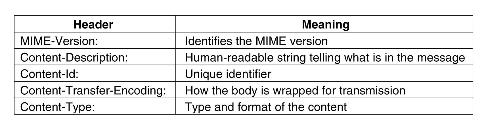

`Content-Transfer-Encoding` s to avoid problems relaying the message for differents MTA. Can be:

* base64
* quoted-printable
* 7bit
* 8bit
* binary

The `Content-Type` can be:

* text
* image
* audio
* video
* applitacion
* message
* multipart

Is necesary define `Content-Type` for multipart messages that contains different type (for example text and attachment)

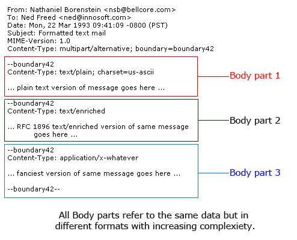

**POP3**

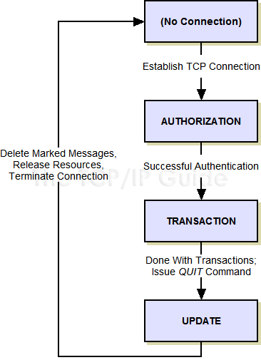

**IMAP**

IMAP keep more stuff in the server, for example, structure of folders and messages that you want to recovery for read it.

The protocol established different states for the connection. Internally, when the connection is established, the server interprets the command that is contained in the messages and do the actions:

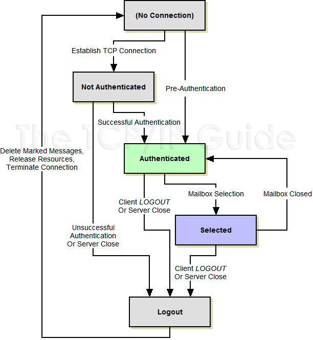

# Your Mail in the client

## With Mail client

Open mail client like **Thunderbird** (Installed by default in Ubuntu) and add two new accounts for `user1@st.um` and `user2@st.um` and try to send and receive messages.

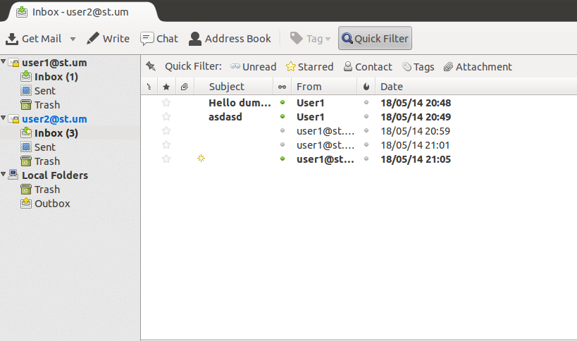


## With terminal

Yea, I know. You need feel like a *hacker* again.

### SMTP

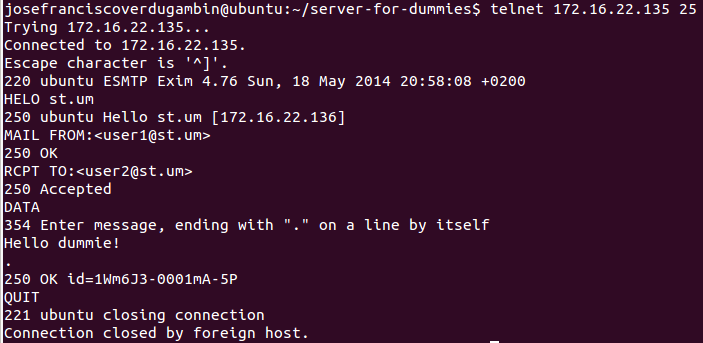

### POP3

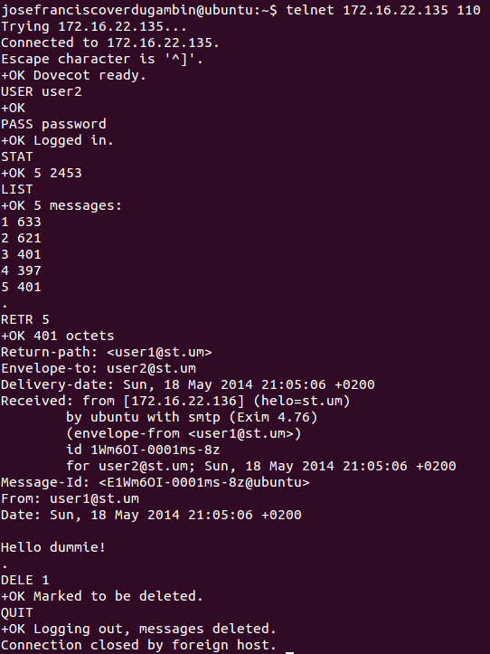

# Your Mail in the server

we will set up two typical services for mail:

* **SMTP** is the protocol to can send emails.
* **POP3** is one of the posibles protrocols to receive mails that we are to use. The other common protocol is **IMAP**.


The differences between POP3 and IMAP are littles but importants:


<table border="1" cellspacing="1" cellpadding="7" width="568">
  <tbody><tr>
    <td width="50%" valign="top" bgcolor="#FFFFFF" background="bg.gif">
      <p align="center"><b>POP3</b></p></td>
    <td width="50%" valign="TOP" bgcolor="#ffffff" background="bg.gif">
      <p align="center"><b>IMAP</b></p></td>
  </tr>
  <tr>
    <td width="50%" valign="TOP">Since email needs to be downloaded into
      desktop PC before being displayed, you may have the following problems for
      POP3 access:
      <ul>
        <li>You need to download all email again when using another desktop PC
          to check your email.</li>
        <li>May get confused if you need to check email both in the office and
          at home.</li>
      </ul>
      <p>The downloaded email may be deleted from the server depending on the
      setting of your email client.</p></td>
    <td width="50%" valign="TOP">Since email is kept on server, it would gain
      the following benefits for IMAP access:
      <ul>
        <li>No need to download all email when using other desktop PC to check
          your email.</li>
        <li>Easier to identify the unread email.</li>
      </ul>
    </td>
  </tr>
  <tr>
    <td width="50%" valign="TOP">All messages as well as their attachments will
      be downloaded into desktop PC during the 'check new email' process.</td>
    <td width="50%" valign="TOP">A whole message will be downloaded only when it
      is opened for display from its content.</td>
  </tr>
  <tr>
    <td width="50%" valign="TOP">Mailboxes can only be created on desktop PC.
      There is only one mailbox (INBOX) exists on the server.</td>
    <td width="50%" valign="TOP">Multiple mailboxes can be created on the
      desktop PC as well as on the server.</td>
  </tr>
  <tr>
    <td width="50%" valign="TOP">Filters can transfer incoming/outgoing messages
      only to local mailboxes.</td>
    <td width="50%" valign="TOP">Filters can transfer incoming/outgoing messages
      to other mailboxes no matter where the mailboxes locate (on the server or
      the PC).</td>
  </tr>
  <tr>
    <td width="50%" valign="TOP">Outgoing email is stored only locally on the
      desktop PC.</td>
    <td width="50%" valign="TOP">Outgoing email can be filtered to a mailbox on
      server for accessibility from other machine.</td>
  </tr>
  <tr>
    <td width="50%" valign="TOP">Messages are deleted on the desktop PC.
      Comparatively, it is inconvenient to clean up your mailbox on the server.</td>
    <td width="50%" valign="TOP">Messages can be deleted directly on the server
      to make it more convenient to clean up your mailbox on the server.</td>
  </tr>
  <tr>
    <td width="50%" valign="TOP">Messages may be reloaded onto desktop PC
      several times due to the corruption of system files.</td>
    <td width="50%" valign="TOP">The occurrence of reloading messages from the
      server to PC is much less when compared to POP3.</td>
  </tr>
</tbody></table>

## Configuring POP3

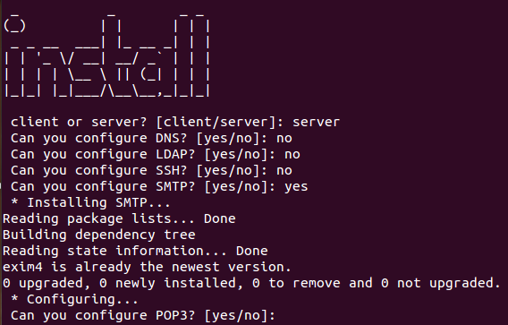

1. Install the service **dovecot** for use POP3 in your server.
2. Configure defaults options in `/etc/dovecot/conf.d/10-auth.conf` and `/etc/dovecot/conf.d/10-mail.conf`.

## Configuring SMTP

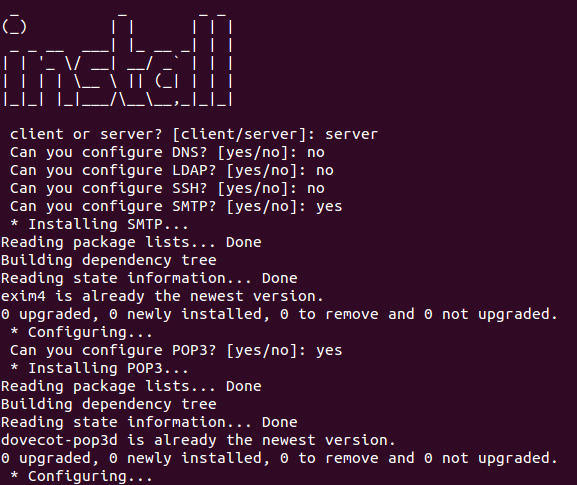

1. Install the service **exim4**
2. Configure standards options in `/etc/exim4/update-exim4.conf.conf` about your DNS:

```
dc_eximconfig_configtype='internet'
dc_other_hostnames='$DNS_NAME'
dc_local_interfaces=''
dc_readhost=''
dc_relay_domains='$RELAY_DOMAINS'
dc_minimaldns='false'
dc_relay_nets='$LOCAL_NETWORK'
dc_smarthost=''
CFILEMODE='644'
dc_use_split_config='false'
dc_hide_mailname=''
dc_mailname_in_oh='true'
dc_localdelivery='maildir_home'
```

#  How Mail Works

## SMTP


Resume

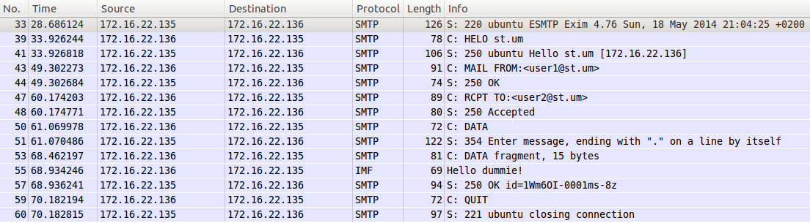

1) Server presentation

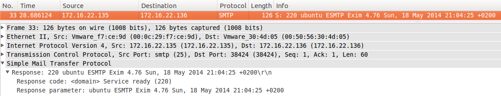

2) Client HELO and sending his IP

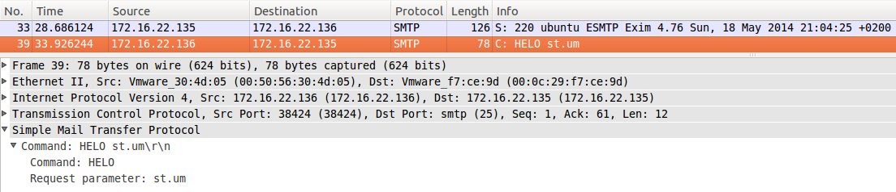

3) Server reply

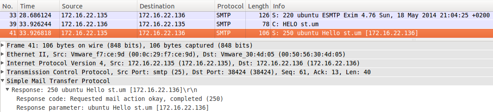

4) Client FROM mail account

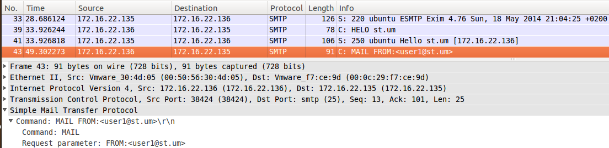

5) Server reply

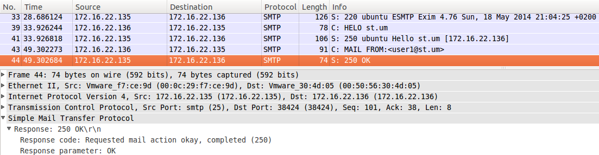

6) Client send RCTP mail account

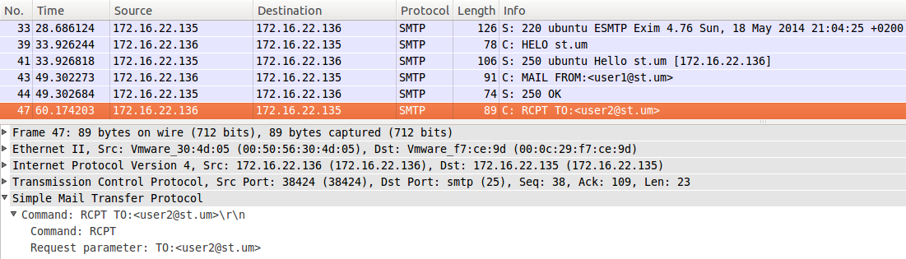

7) Server reply
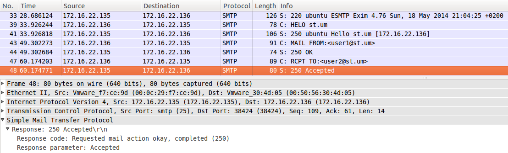

8) Client prepare to send DATA

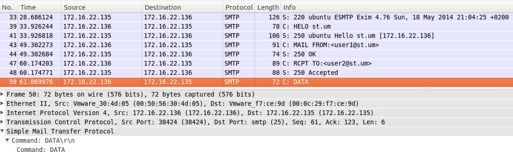

9) Server reply and say that write a "." to finish the message

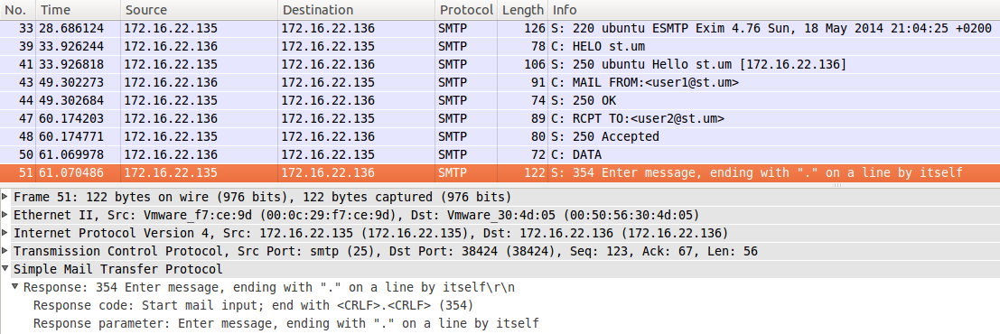

10) Client send the text of the message

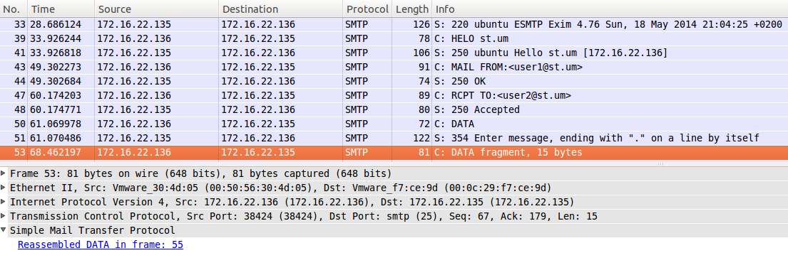


11) Server reply when the client finish to send the message

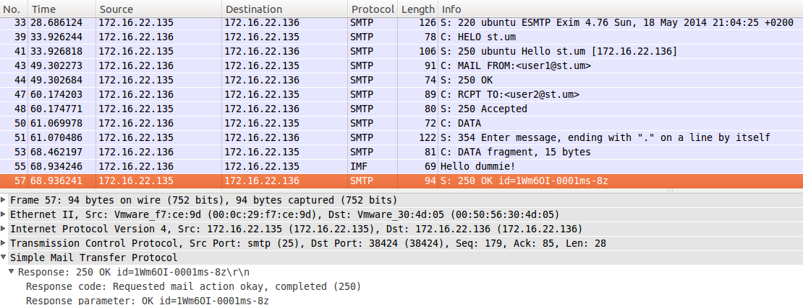

12) Client termiante the connection

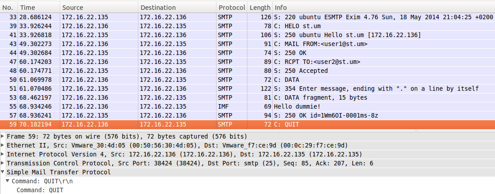

13) Server reply

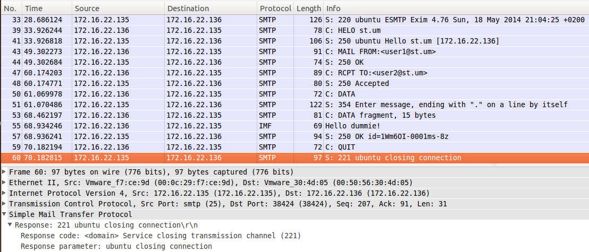

## POP3

The most commonly used commands in a POP3 connection are as follows:

> **USER <username>**
> **PASS <password>**
> Command to make login with a username and password. The server response if the login is correct or not.
>
> **STAT**
> STAT simply responds with a single line consisting of two numbers: the number of messages in the box and the total size of those messages in bytes. It's useful for human beings, but less so for automatic clients, which are likely to jump straight to the LIST command.
>
> **LIST**
> LIST lists the contents of the mailbox, naturally enough. It does so by using the standard POP3 multi-line response format. Here's an example:
>   LIST
>   +OK Mailbox contents follow
>   1 7774
>   2 513
>   3 10493
>   .
> The terminating line is a period on a line by itself, which is pretty standard for mail protocols in general. Each line consists of the mail message number (if you delete one, it won't appear in the list, so don't fall into the trap that the numbers are sequential and can thus be ignored!) followed by the size of the message in bytes.
> LIST plus a message number will simply act like STAT for that message.
>
> **RETR msg**
> RETR retrieves a message. Use the message number from LIST. Note that you'll receive the true text of the message, headers followed by a blank line followed by the body, followed by a period on a line by itself. If the body actually contains a period on a line by itself, the mail server will already have doubled that period. So your client needs to undouble it.
>
> **DELE msg**
> DELE deletes a message. It won't actually be deleted until you QUIT the session, and you can undelete everything you've deleted (in case of a mistake) by using RSET.
>
> **RSET**
> You can reset the session to its initial state using the RSET command. This will undelete all messages deleted using DELE.
>
> **TOP msg n**
> TOP is actually an optional command, but most servers support it now. It returns the headers of message msg plus n lines of the body. If n is zero, of course, you just get the headers, which is nice for doing filtering without having to get the entire message.
>
> **QUIT**
> QUIT terminates the session and deletes any messages marked with DELE.


Resume

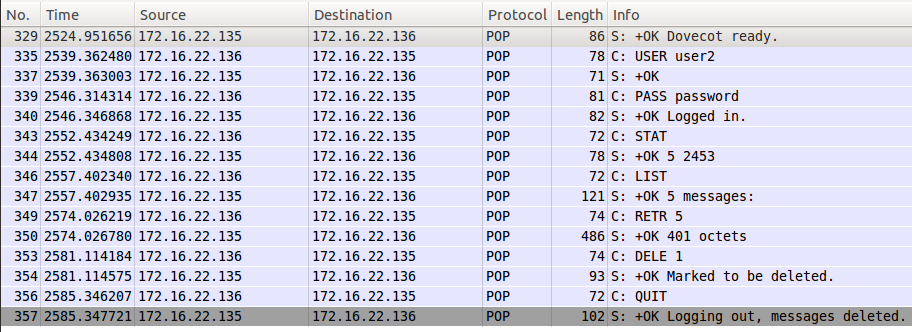

1) Server presentation2.

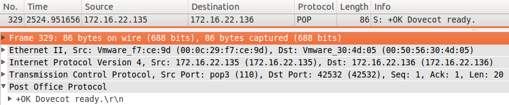

2) Client identify with USER command

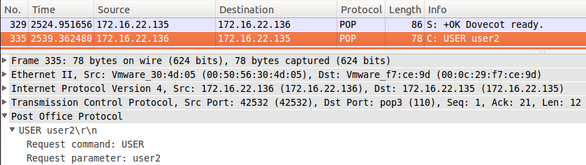

3) Server reply

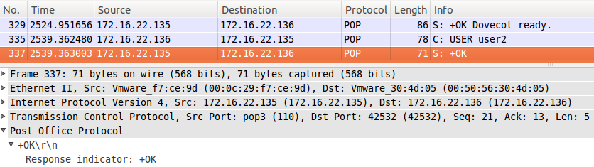

4) Client type password with PASS command

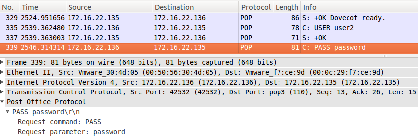

5) Server reply and say that loggin is correct

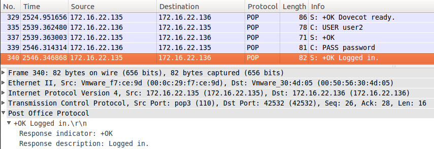

6) Client use STAT command

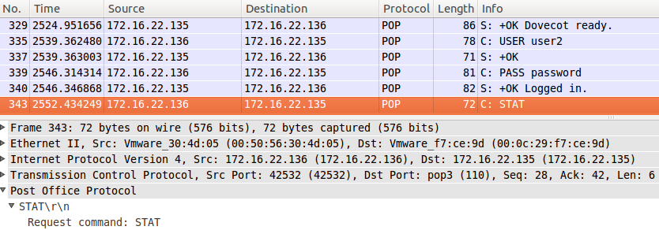

7) Server Reply

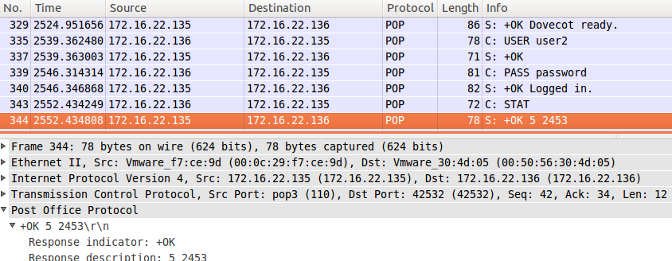

8) Client use LIST command

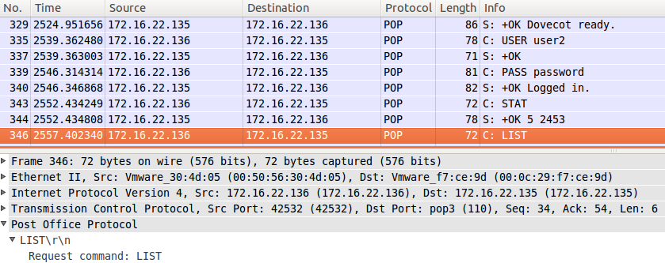

9) Server reply with list of messages

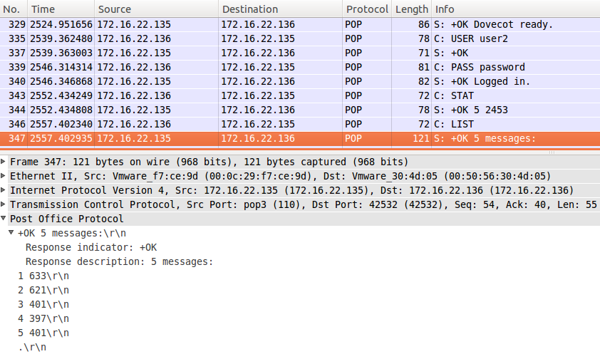

10) Client say that want to see the message No.5

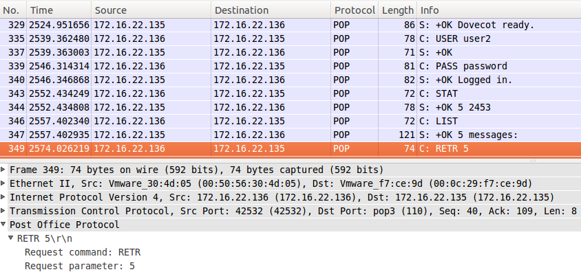

11) Server reply with the message content
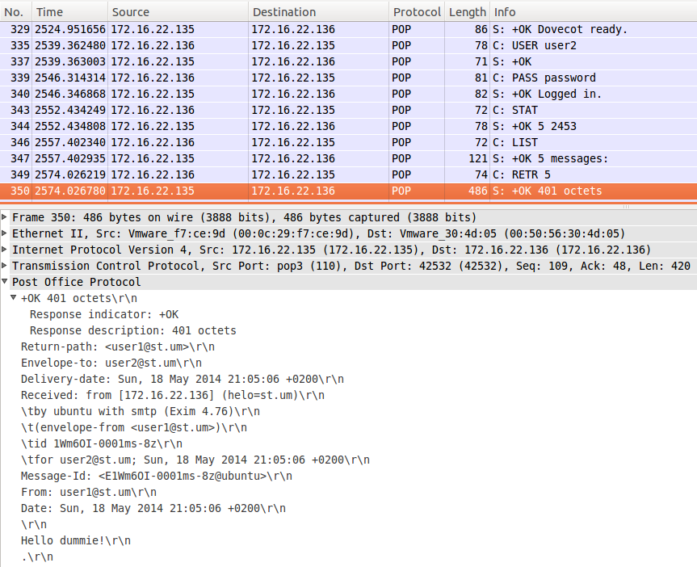

12) Client use DELE command

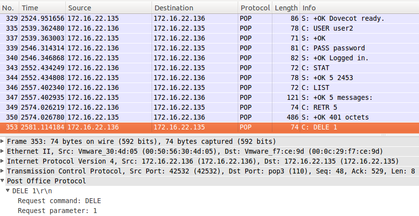

13) Server reply

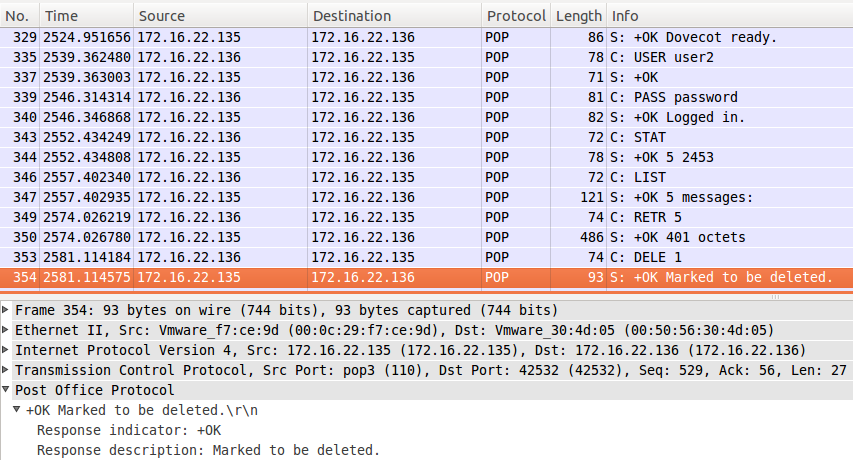

14) Client use QUIT command for desconnection

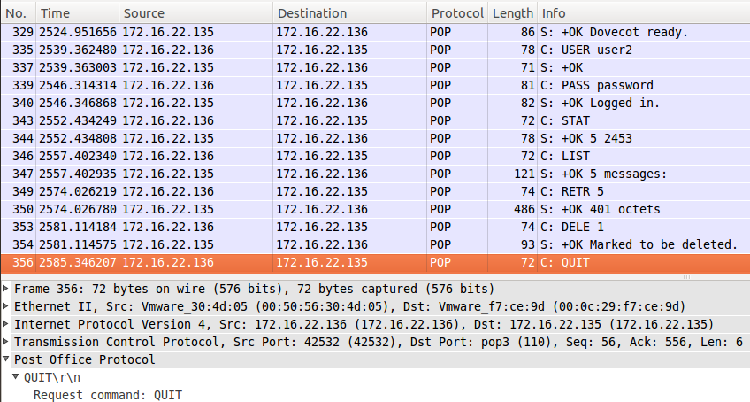

15) Server reply

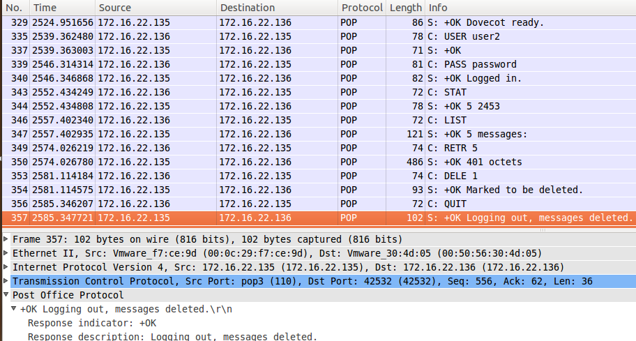

# SSH

SSH (*Secure Shell*)  is a cryptographic network protocol for secure data communication, remote command-line login, remote command execution, and other secure network services between two networked computers.

It was designed as a replacement for Telnet and other insecure remote shell protocols such as the Berkeley rsh and rexec protocols, which send information, notably passwords, in plaintext, rendering them susceptible to interception and disclosure using packet analysis. The encryption used by SSH is intended to provide confidentiality and integrity of data over an unsecured network, such as the Internet.

# Your SSH in the client

The client needs **openssh-client** that is usually installed on UNIX systems default

Also need to generate a **SSH public key** to identify the computer. SSH keys are a way to identify trusted computers, without involving passwords.

**Check your SSH keys**

```
cd ~/.ssh
ls -al
# Lists the files in your .ssh directory
```

**Generate a new SSH key**

```
ssh-keygen -t rsa -C "your_email@example.com"
# Creates a new ssh key, using the provided email as a label
# Generating public/private rsa key pair.
# Enter file in which to save the key (/Users/you/.ssh/id_rsa): [Press enter]
Enter passphrase (empty for no passphrase): [Type a passphrase]
# Enter same passphrase again: [Type passphrase again]
Your identification has been saved in /Users/you/.ssh/id_rsa.
# Your public key has been saved in /Users/you/.ssh/id_rsa.pub.
# The key fingerprint is:
# 01:0f:f4:3b:ca:85:d6:17:a1:7d:f0:68:9d:f0:a2:db your_email@example.com
```

Now you can connect with your server with `ssh` command:

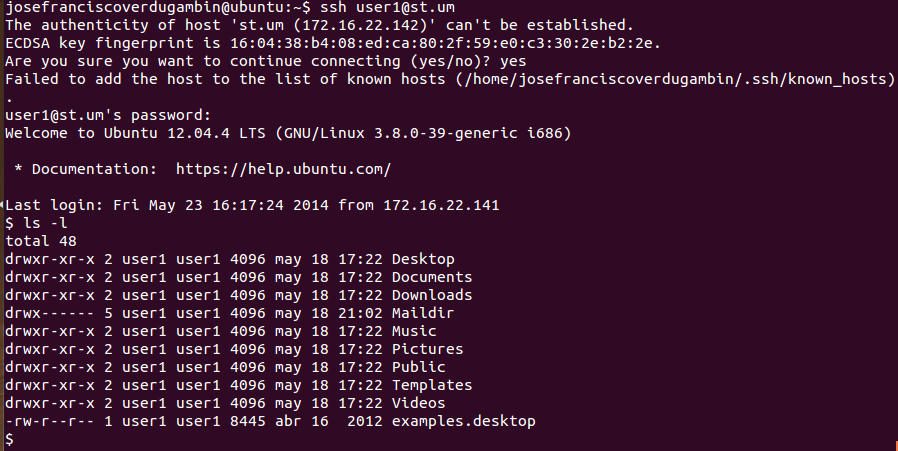

# Your SSH in the server

Only need to install **openssh-server**.

# How SSH works

Resume of messages:

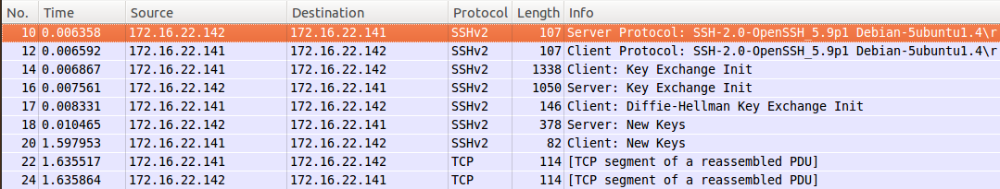

1) Client first message

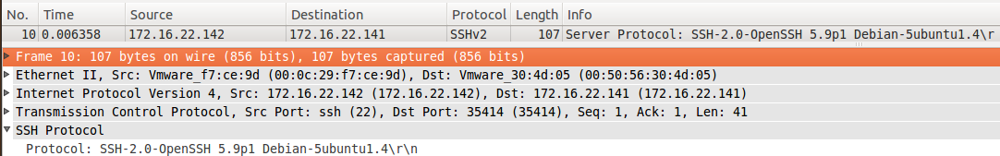

2) Server first message

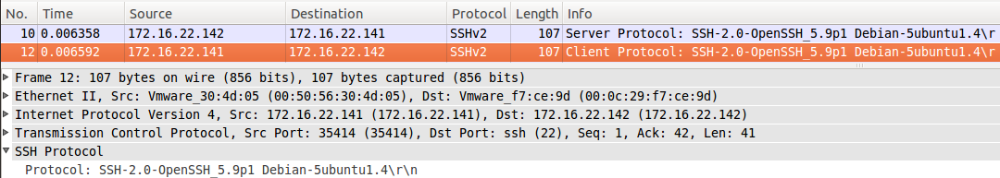

3) Client send `CLIENT_KEY_EXCHANGE`

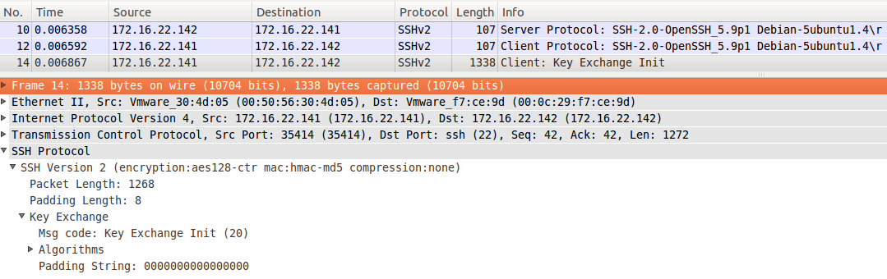

4) Server send `CLIENT_KEY_EXCHANGE`

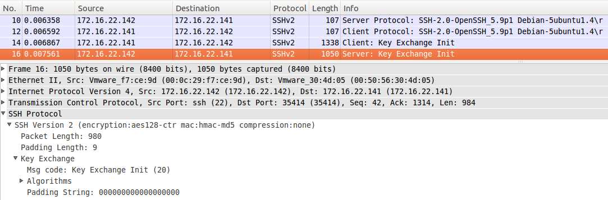

5) Exchange sucess!

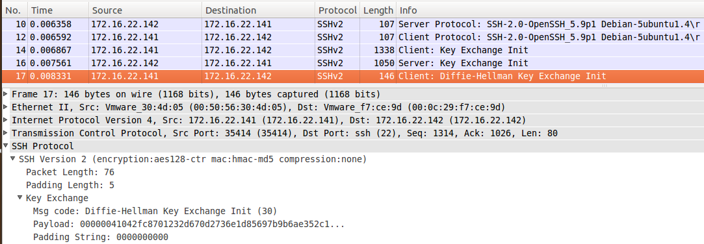

6)

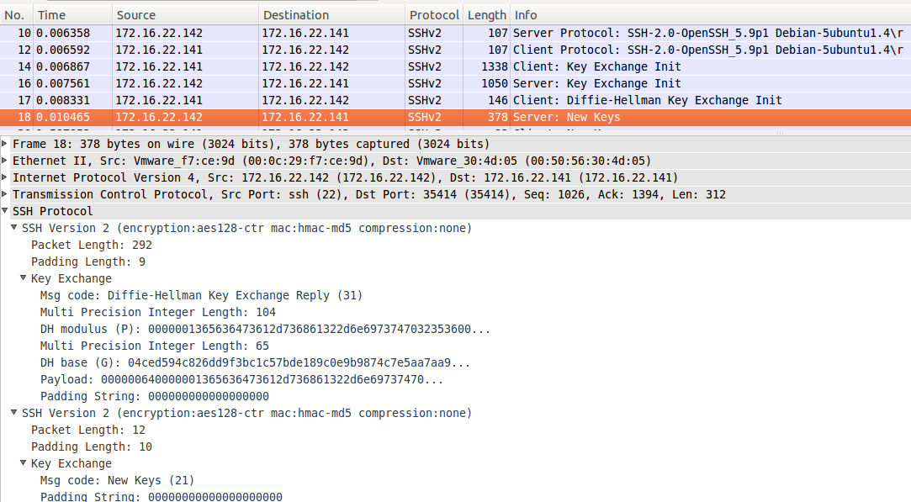

7)

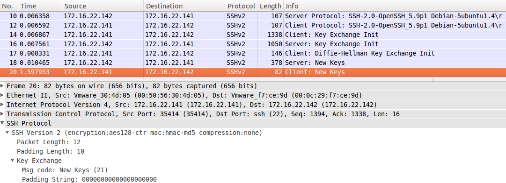

# SSL

SSL (*Secure Sockets Layer*) is the standard security technology for establishing an encrypted link between a web server and a browser. This link ensures that all data passed between the web server and browsers remain private and integral. SSL is an industry standard and is used by millions of websites in the protection of their online transactions with their customers.

SSL does two things:

1. **Authenticates the server to the client.** (*Handshake*)
2. Encrypts your HTTP session.

We go to explain **Handshake** process:

* Client send `clientHello` message specifying encrypted options: SSL version, compress method,... and sending random numbers that they use later.
* The server receive the message and select:
	* What simetric algorythm (**secret key**) use (e.g. [AES](https://en.wikipedia.org/wiki/Advanced_Encryption_Standard), [3DES](https://en.wikipedia.org/wiki/Triple_DES), [RC5](https://en.wikipedia.org/wiki/RC5)).
	* What asimetric algorythm (**public key**) use (e.g. [RSA](wiki/RSA_(cryptosystem), [Diffie-Hellman](https://en.wikipedia.org/wiki/Diffie%E2%80%93Hellman_key_exchange)).
	* What MAC algorythm use ([SHA](https://en.wikipedia.org/wiki/Secure_Hash_Algorithm)).


Why select simetric and asimetric algorythm? Why not use only one?

When client finally send data to the server, they use simetric algorythm, but first, to get it, they need to negotiate and exchange confidence information. This proceed is known as **Pre Master Key**.

There are two ways to do Pre Master Key process:

1. With **Diffie-Helman**: Client and server exchange `SERVER_KEY_EXCHANGE` and `CLIENT_KEY_EXCHANGE` and both parts know 	the information to operate with simetric algorythm.

2. With **RSA**: The client catch the public key of the Server Certificate (message `CERTIFICATE`)and encrypted the master key. Only the server can desncrypted this with her private key.

And send to the client `serverHello` with this options, distinctive server number and their certificates to check the identify of the server domain.


But, one moment... Why am I going to trust the server? and if not who he claims to be?

Before Pre Master Key process is necessary for the server to authenticate it, for do it is also necessay asimetric algorythm, normally with RSA. And then, thec MAC algorythm is use to verify that data of the session is authenticathed.

We can resume all the process with two variants of message:

* **TLSv1_RSA_WITH_AES_128_CBC_SHA**
	- **TLSv1**: version of TLS (SSL protocol)
	- **RSA**: For server authentication and pre master key process.
	- **AES**: For simetric algorythm after master key
	- **SHA**: For MAC encryptation

* **TLSv1_DHE_RSA_WITH_AES_256_CBC_SHA**
	- **TLSv1**: version of TLS (SSL protocol)
	- **DHE**: For server authentication based of Diffie-Helman for pre master key.
	- **RSA**: For server authentication.
	- **AES**: For simetric algorythm after master key.
	- **SHA**: For MAC encryptation.

The resume of the process in one image:


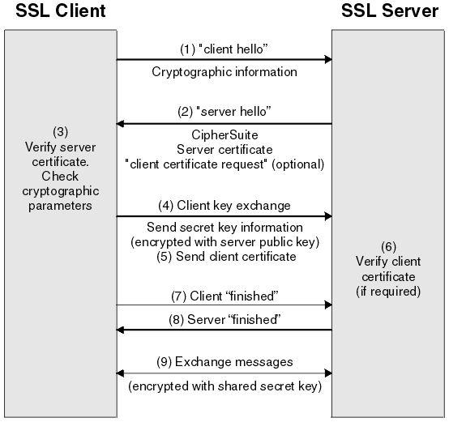

The complexities of the SSL protocol remain invisible to your customers. Instead their browsers provide them with a key indicator to let them know they are currently protected by an SSL encrypted session - the lock icon in the lower right-hand corner, clicking on the lock icon displays your SSL Certificate and the details about it. All SSL Certificates are issued to either companies or legally accountable individuals.

# SSL in the client

If the server has done its homework anything is necessary in the client, only have a modern browser and the `*.pem` to load it (see part of SSL in the server).

When you join in the HTTPS website the certificate is downloaded automatically

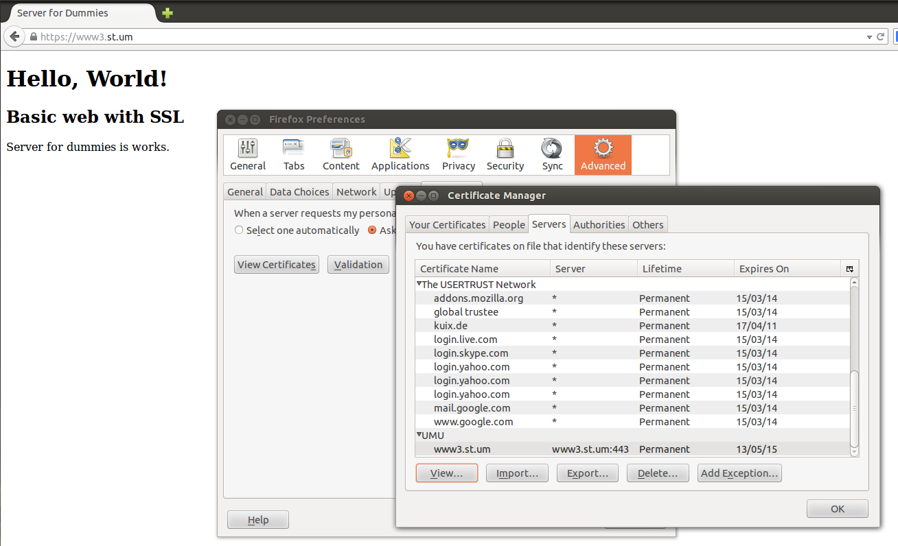

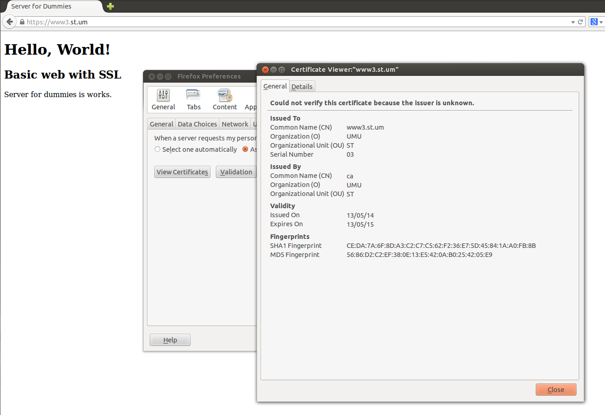

# SSL in the server

For have SSL in HTTP known as HTTPS first you need to have HTTP service.

For have HTTPS you need a certificate to expose that your domain is secure and you are your owner.

Now we are to explain how to generate your certificate for do a illustrative example, but in the practice the SSL certificate is created by **Certification Authority** (*CA*) that typically are companies of hosting. Remember this.

The CA establishes a chain of trust between he and domains of users:


About what your need in your server we use **openssl** that is typically installed in UNIX systems by default.

The process is divided in two steps: First need to generate the CA autosign for the server and later generate the clien certificate and sign it with serve CA.

Typically an SSL Certificate will contain your domain name, your company name, your address, your city, your state and your country. It will also contain the expiration date of the Certificate and details of the Certification Authority responsible for the issuance of the Certificate. When a browser connects to a secure site it will retrieve the site's SSL Certificate and check that it has not expired, it has been issued by a Certification Authority the browser trusts, and that it is being us.

**CA Certificate in the server**

first need to know OpenSSL directory. In terminal type:

```
openssl version -d
```

And report you the directory, typically `usr/lib/ssl`. Now we need to edit `openssl.cnf` and update this entries with your values. In my case this are my values:

```
....
[ CA_default ]
...
dir = ./demoCA
countryName_default = ES
stateOrProvinceName_default =
0. organizationalName_default = UMU
organizationalUnitName_default = ST
...
```

because my domain is a Spanish domain and the domian for the exmaple is `st@um`.

Now go to adjust options to generate a certificate. in the same file and go to `[ policy_match ]` section and update set `stateOrProvinceName` value to `optional`.

Go to the path of CA_default and create `demoCA` folder with this structure:

```
cd $HOME
mkdir -p demoCA && cd demoCA
mkdir -p newcerts
mkdir -p certs
touch index.txt
echo "00" > clrnumber
echo "01" > serial
```

Now you are ready to generate the certificate. To do it, run the appropriate command:

```
openssl req -x509 -newkey rsa:2048 -keyout cakey.pem -days 3650 -out
cacert.pem
```

You can check that your certificate is correct with this commands:
```
openssl x509 -in cacert.perm -text
openssl rsa -in cakey.perm -text
```

**CA Certificate in the client**

First generate it:

```
openssl req -new -nodes -newkey rsa:1024 -keyout serverkey.pem -out servercsr.pem
```

And later sign it:

```
openssl ca –keyfile cakey.pem -in servercsr.pem -out servercert.pem
```
The certificate on `*.pem` is necessary because is the format that the browser can read the certificate.

You can check that certificate is valid running this command:
```
openssl s_server -cert servercert.pem -key serverkey.pem -CAfile clientcert.pem
```

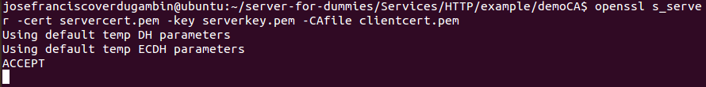

# How SSL Works

Resume of the process:

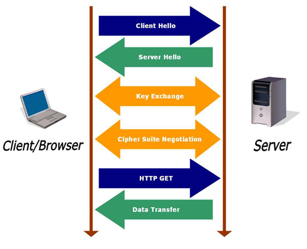

Resume of messages:

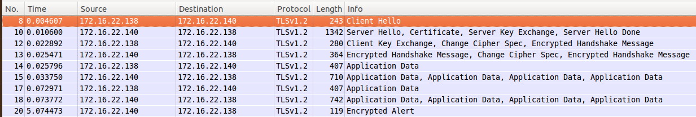

1) Client send `HELLO` message with distinctive random number and information about what compression and Cipher suites support and request to the server the X509 certificate to trust him.

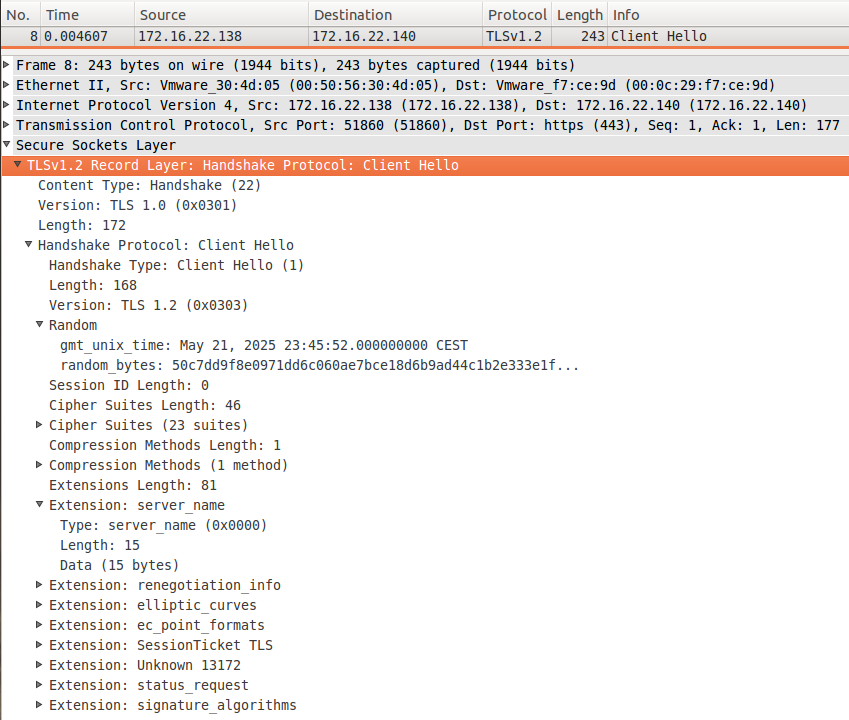

2) The server receive the message and:

1. Read the `HELLO` message of the client and select the options of the session.
2. Send to the client the Certificate to show that you can trust him.
3. do `SERVER_KEY_EXCHANGE` as part of the process of Pre Master Key

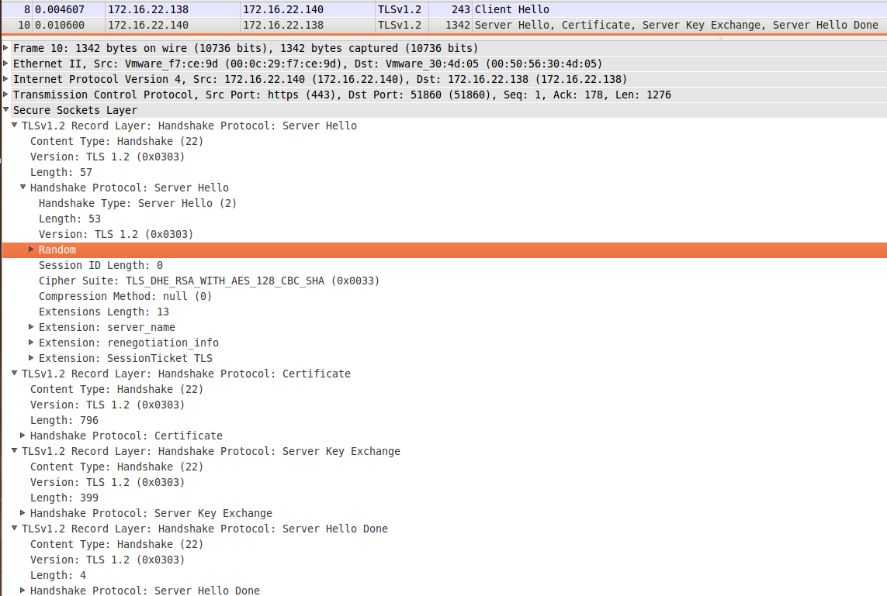

3) Client receive server message and proceed to:

1. Validate the identity of the server.
2. do `CLIENT_KEY_ECHANGE` as part of the process of Pre Master Key.

at this moment client can be calculate the **Master Key**.

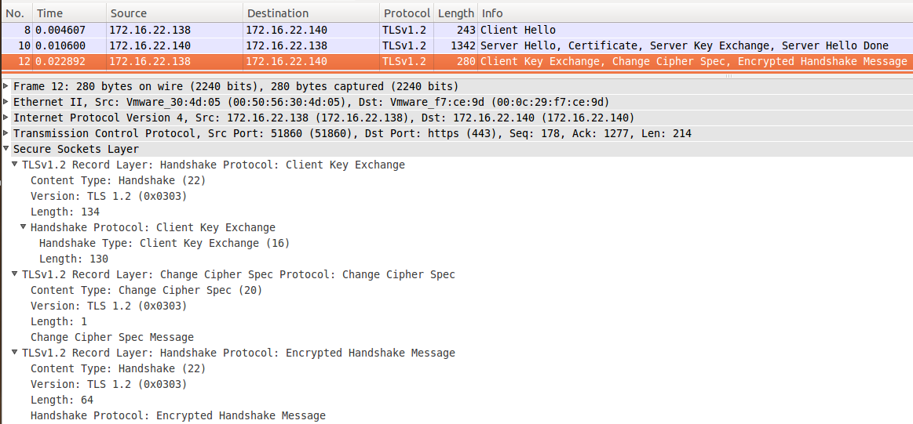

4) Server receive client message and can calculate **Master Key**. From here both part have a shared secret

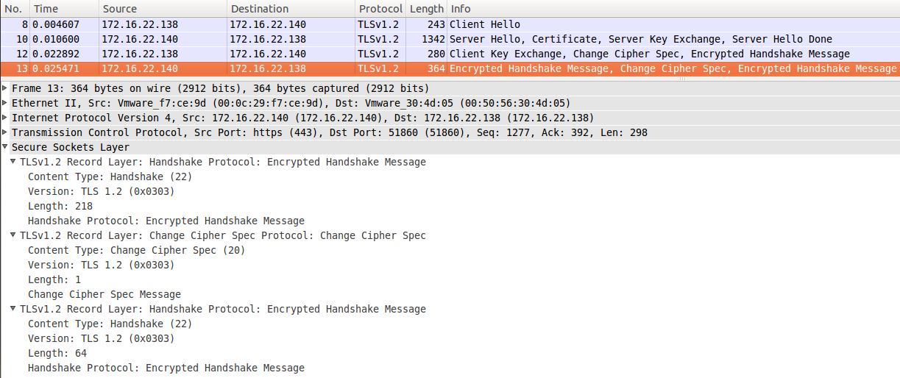

5) The information from here can travel encrypted. Is not posible see the data content

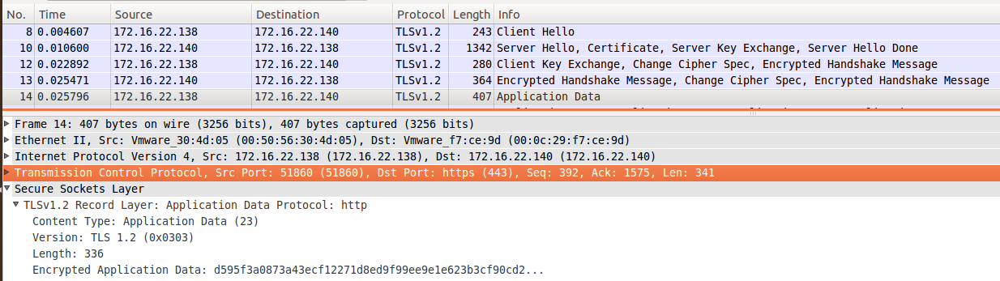

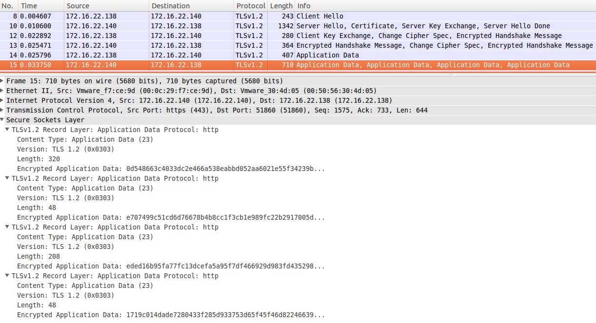

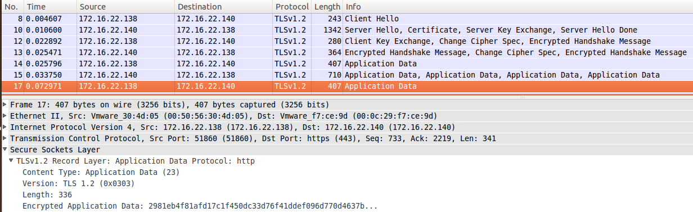

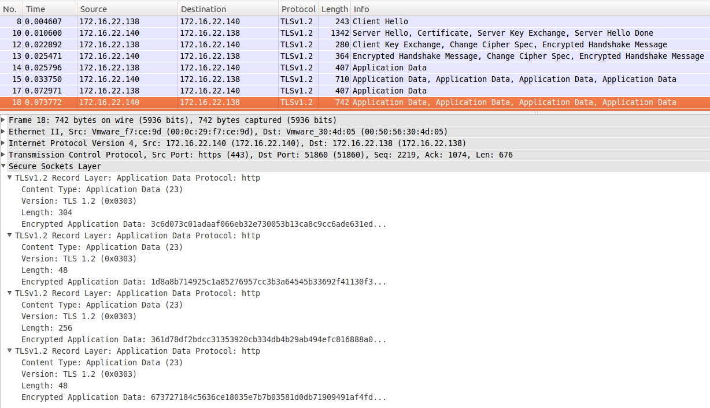

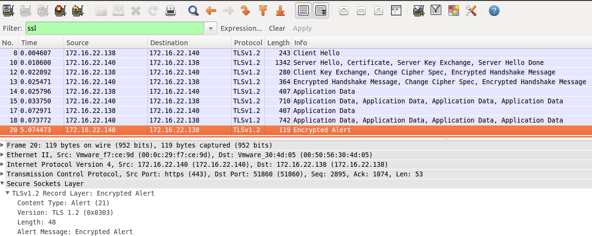
